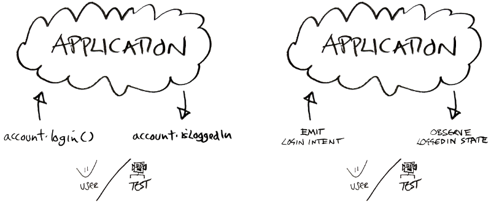

# MVO Architecture

This little library helps you implement an architecture we'll call **MVO (Model View Observer)**.


That block diagram above is what MVO looks like (it's simplified of course, further details below).

By [**Model**](https://erdo.github.io/android-fore/02-models.html#shoom) we mean the standard definition of a software model, there are no particular restrictions we will put on this model other than it needs to be somehow observable (when it changes, it needs to tell everyone observing it that it's changed) and it needs to expose its state via quick returning getter methods. The model can have application level scope, or it can be a View-Model - it makes no difference from an MVO perspective.

By [**Observer**](https://en.wikipedia.org/wiki/Observer_pattern) we mean the standard definition of the Observable pattern. In MVO, the Views observe the Models for any changes. (This has nothing specifically to do with rxJava by the way, though you absolutely can implement an MVO architecture using rxJava if you wish).

By [**View**](https://erdo.github.io/android-fore/01-views.html#shoom) we mean the thinest possible UI layer that holds buttons, text fields, list adapters etc and whose main job is to observe one or more observable models and sync its UI with whatever state the models hold. If you're going to implement MVO on android you might choose to use an Activity or Fragment class for this purpose. Most of the examples here however use custom view classes which ultimately extend from *android.view.View*.

In a nutshell this is what we have with MVO:

> "Observable **Models**; **Views** doing the observing; and some **Reactive UI** tricks to tie it all together"


Another way to look at it is in *crap diagram* mode. So here's a crap diagram showing the flow of a button click from **step 1** to **3** with a single **observable model** and a **view** that observes it:

<a name="bad-diagram"></a>


Importantly, during the syncView() stage, the view syncs [**all the view states**](https://erdo.github.io/android-fore/03-databinding.html#syncview), it's a fundamental part of why **fore** code looks so sparse.

That diagram matches what is happening in [**sample app 1**](https://erdo.github.io/android-fore/#fore-1-data-binding-example). Here are the relevant bits of code: the [**observable model code**](https://github.com/erdo/android-fore/blob/master/example01databinding/src/main/java/foo/bar/example/foredatabinding/feature/wallet/Wallet.java) and the [**view code**](https://github.com/erdo/android-fore/blob/master/example01databinding/src/main/java/foo/bar/example/foredatabinding/ui/wallet/WalletsView.java) that does the observing.

One great thing about MVO is that the view layer and the rest of the app are so loosely coupled, that supporting rotation already works out of the box. In all the examples above, the code just works if you rotate the screen - without you needing to do a single thing.

> "the code works if you rotate the screen - without you needing to do a single thing"

The code looks extremely simple and it is, but surprisingly the technique works the same if you're using [**adapters**](https://github.com/erdo/android-fore/blob/master/example03adapters/src/main/java/foo/bar/example/foreadapters/ui/playlist/PlaylistsView.java) [\[screen shot\]](https://raw.githubusercontent.com/erdo/android-fore/master/example03adapters/screenshot.png), or if you're doing [**threaded work in your model**](https://github.com/erdo/android-fore/blob/master/example02threading/src/main/java/foo/bar/example/forethreading/ui/CounterView.java), or fetching data [**from a network**](https://github.com/erdo/asaf-full-app-example/blob/master/app/src/main/java/co/early/asaf/fullapp01/ui/fruitcollector/FruitCollectorView.java). It even works when you have a heavily animated view like we do in [**sample app 5**](https://erdo.github.io/android-fore/#fore-5-ui-helpers-example-tic-tac-toe) here's the [**view code**](https://github.com/erdo/android-fore/blob/master/example05ui/src/main/java/foo/bar/example/foreui/ui/tictactoe/TicTacToeView.java) for that app. Here's a kotlin [**view**](https://github.com/erdo/password123/blob/master/app/src/main/java/co/early/password123/ui/passwordchooser/PwChooserView.kt) which is probably one of the most complicated view layers you will encounter with MVO due to all the animation code written in it.


## Handling State
In MVO, the state is kept inside in the models, typically accessible via getter methods. You'll notice that's not particularly functional in style, but it's one of the reasons that MVO has such shockingly low boiler plate compared with other data-binding techniques. And this shouldn't worry you by the way (dependency injection is not a functional pattern either) as developers we aim to select the best tool for the job.

Whatever drives the state of your models and the rest of your app can be as functional as you want of course.

*Depending on how far you want to go down the functional route with your android app, you might want to look into [MVI](https://www.youtube.com/watch?v=PXBXcHQeDLE&t) as a functional architecture alternative (YMMV of course. I've used it, it can be a little heavy for anything more than a fairly trivial UI - by heavy I mean it needs a lot of boiler plate code to be written). If you're coming from MVI, MVO should be quite recognisable: MVO's syncView() is a very close equivalent to MVI's render(), comparison of the two architectures [here](#comparison-with-mvi)*

There is further discussion of state versus events [**here**](https://erdo.github.io/android-fore/05-extras.html#state-versus-events)

<a name="comparisons-with-mv"></a>
## From MV* to MVO

A little bit of background if you are coming from a different architecture, definitely not required reading though (you might want to head over to the discussion on [**Views**](https://erdo.github.io/android-fore/01-views.html#shoom) at this point).

Discussions of **MVC**, **MVP** and **MVVM** can get quite abstract, and specific implementations often differ considerably. For the purposes of our discussion the following flow diagrams will do:


This is quite a common representation of **MVC**, however I don't think it's a particularly useful diagram - it depends entirely on the specifics of your controller which often isn't mentioned at all. If you are considering your Android Activity class to be the controller, then implementing something like this on Android can get a little messy. *(In the 8 years or so I've been a contract Android developer, I've learnt the hard way that it's usually best to remove as much code from activity/fragment classes as possible)*. If you are considering your controllers to be your click listeners then it's basically a nothing diagram that shows a View interacting with a Model. (See below for a discussion of [Controllers](#btw-whats-a-controller)).

There is one important thing to note about about this diagram however. If we focus on the Model, all the arrows (dependencies) point towards the Model. This tells us that while the View and Controller know about each other and the Model, the Model knows nothing about the View or the Controller. That's exactly the way we want it. This way a Model can be tested independently, and needs to know nothing about the view layer. It can support any number of different Views which can come and go as they please (when an Android device is rotated for example, the Model is not affected - or even aware of it).

I did say that I thought the typical MVC diagram is not particularly useful, I think it's main purpose is just to be shown before the MVP diagram is - so that we can see a particular difference. So here is a typical MVP diagram:


It's basically the same thing except here the View doesn't know about the Model. All interactions with the Model go via a Presenter class. The Presenter class usually does two main things: it sets UI states on the View (so it needs to know about the View) and it forwards commands from click listeners and the like, to the underlying Model / Models (so it needs to know about those Models too).

In a typical MVP Android app, quite a bit of boiler plate is required to let the Presenter do its job, typical implementations also create the Presenter from scratch each time the view is constructed, and that can make handling rotations difficult.

Note that as with MVC, the Model is not aware of the higher level View related classes - which is a good thing. Moving code from the View to a Presenter class also means that we can now unit test it, which is great. (The Presenter is aware of the View but this is usually via an injected interface, so for a unit test you don't need to set up an actual View, just its interface)

The main issue with both of these approaches on Android though, is the arrow pointing to the View


Android has a particular problem with this as the Views are destroyed and created even due to a simple screen rotation and each time that happens, all the references need to be recreated.

Here's the MVVM equivalent diagram:


Again there are different ways of doing MVVM, even on Android, but the main difference here is that the View-Model is not aware of the View like the Presenter is. All the arrows go from the edge of the system where the UI is, towards the centre where things like business logic reside, down in the model layer.

In MVVM you typically have a View-Model for each View, so even though there are no dependencies on the View from the View-Model (no arrow pointing from View-Model to View), it's still a specific implementation for that View, you can't use one View-Model for different Views. A slightly more realistic situation for a whole app with different views looks like this:


You can implement this using something like LiveData on Android, but when you get into the details I think the solution has a few issues related to [this](https://erdo.github.io/android-fore/05-extras.html#somethingchanged-parameter) and the inability to use something equivalent to the surprisingly powerful [syncView](https://erdo.github.io/android-fore/03-databinding.html#syncview) convention that exists in MVO (or render() in MVI) - it's a considerable step forward none the less, and it may work for you. Importantly, all the arrows are pointing the right way! (which, no surprise, happens to match the direction of the arrows in [clean architecture](https://8thlight.com/blog/uncle-bob/2012/08/13/the-clean-architecture.html))

### Finally MVO

As we mentioned, here is what MVO looks like in a real app:


Well how does that work? you can't just remove boxes and call it better! (I hear you say).


> "Observable **Models**; **Views** doing the observing; and some **Reactive UI** tricks to tie it all together"


As with all the architectures discussed so far, here the Model knows nothing about the View. In MVO, when the view is destroyed and recreated, the view re-attaches itself to the model using the observer pattern. Any click listeners or method calls as a result of user interaction are sent directly to the relevant model (no benefit here in sending them via a Presenter). With this architecture you remove a lot of problems around lifecycle management and handling rotations, it also turns out that the code to implement this is a lot less verbose **(and it's also very testable and scalable)**.

**There are a few important things in MVO that allow you an architecture this simple:**

* The first is a very robust but simple [**Observer implementation**](https://erdo.github.io/android-fore/03-databinding.html#fore-observables) that lets views attach themselves to any model they are interested in
* The second is the [**syncView()**](https://erdo.github.io/android-fore/03-databinding.html#syncview) convention
* The third is writing [**models**](https://erdo.github.io/android-fore/02-models.html#shoom) at an appropriate level of abstraction, something which comes with a little practice
* The fourth is making appropriate use of [**DI**](https://erdo.github.io/android-fore/05-extras.html#dependency-injection-basics)

 If you totally grok those 4 things, that's pretty much all you need to use MVO successfully, the [**code review guide**](https://erdo.github.io/android-fore/05-extras.html#troubleshooting--how-to-smash-code-reviews) should also come in handy as you get up to speed, or you bring your team up to speed.

### Comparison with MVI
 *(Incidentally, the author currently works in a large commercial team implementing MVI in a published app)*

 The two architectures are very similar in that they both have a single method that updates the UI according to state.

 **MVO has syncView()** which takes no parameters. The method sets the UI according to whatever models it has, eg:

 ```
 loggedInStatus.setText(
   accountModel.isLoggedIn() ? "IN" : "OUT")
 ```

 **MVI has render()** which takes a ViewState parameter containing all the required state for the UI, eg:

 ```
 loggedInStatus.setText(
   viewState.isLoggedIn ? "IN" : "OUT")
 ```

 Most testing takes place just below the UI layer for both architectures:

 

 In **MVI** a typical test would be to make sure that an **Intention/Intent** made by a user results in the correct **ViewState** being returned to the UI layer. For example, test that the LOGIN_INTENTION is processed correctly (i.e. gets converted to a LOGIN_ACTION, is processed via an interactor to create a LOGIN_RESULT, which is then *reduced* and combined with previous view states to produce a ViewState object (including a field like ViewState.isLoggedIn = true), for passing back to the UI). The reason for the complication with MVI is that the whole thing is functionally written so that the resulting ViewState returned via the render() method is *immutable*. Luckily the tests don't need to know much about this and mostly just compare the INTENTION with an expected RESULT.

 **MVO** simply tests that when you call accountModel.login() you a) receive a notification if you are observing that model and it changes and b) the accountModel.isLoggedIn() method subsequently returns the expected value.

 *Both architectures mock out dependencies and have strategies for dealing with asynchronous code which makes the tests small.*

 There is a thin part of the app that can only be tested with the help of android itself (and is therefore sometimes skipped). For **MVI**: testing that when you click on the login button it actually emits a LOGIN_INTENTION for processing. For **MVO**: testing that when you click on the login button, it actually calls accountModel.login().

 On the return trip to the UI: For **MVI**: testing that when render() is called with the appropriate ViewState, the login text does actually read "Logged in". For **MVO**: testing that when syncView() is called with an appropriately mocked accountModel object, the login text does actually read "Logged in".

 *Both architectures support rotation on Android although it's not quite so trivial in MVI, mostly due to its functional/immutable nature.*

 It goes without saying that the amount of code that needs to be written to implement MVI is considerably more than with MVO (this is the price you pay for writing UI data-binding code in a functional style). The difference becomes more significant with views that depend on a number of different data sources, each of which may need reacting to (such as an AccountModel, EmailInbox and NetworkStatus). Most of this additional code will be written in the Interactor class, so at least it remains testable.


### BTW, What's a Controller
It helps to remember that MVC is at least 3 decades old, I think it was Microsoft who invented it [I saw a Microsoft white paper written about it once, but I can't find it anywhere now]. A controller means different things on different platforms.

Originally a controller might have been a class that accepts mouse clicks at specific pixel co-ordinate, did some collision detection to find out which UI component was clicked, then sent that information on to the appropriate UI classes for further processing. (A controller in a web app however, might be a main entry point URL that forwards on requests to different parts of the system.)

In modern app frameworks most of the controller work is implemented for you by the UI framework itself - these are the button click listeners that simply catch user input and send it on to the right place. As we need to worry less about controllers now a days, we talk more about more "modern" things like MVVM - which is only about **10(!)** years old.

(Android also lets you use Activities as kind of "Controllers" by letting you specify callback methods right in the XML for buttons which will end up getting called on whatever activity is hosting that particular view. The idea is to not have to write click listeners - unfortunately this encourages (forces) you to get the activity involved in something that it doesn't need to be involved in, which usually doesn't end well. If you leave everything out of the Activity then you can often re-use your custom view in any activity or fragment you like, without needing to re-implement all those button call backs each time.)
