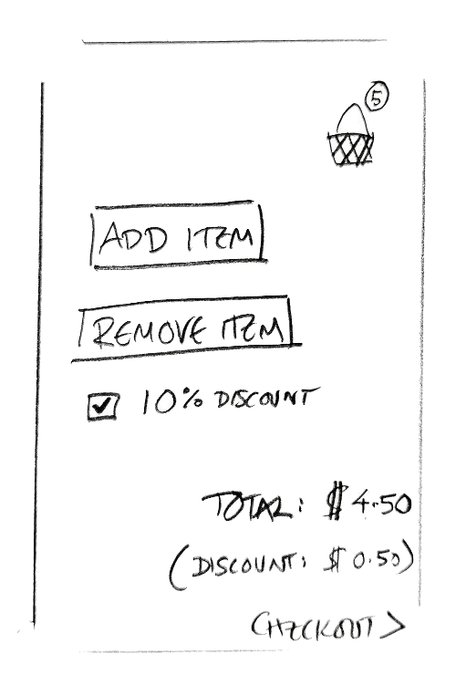

# Data Binding

For some reason data binding is not something that is discussed much in Android circles, so just in case, a basic definition of one way databinding could be: any changes of state that happen in your underlying model, get automatically represented in your view.

> "Any changes of state in your underlying model, get automatically represented in your view."

So if your shopping basket model is empty: the checkout button on your view needs to be invisible or disabled. And as soon as your shopping basket model has something in it, your checkout button needs to reflect that by being enabled. This concept is decades old, and in UI frameworks is generally implemented with some form of Observer pattern.

Lately it's been applied to other (non UI) areas of code very successfully under the name of *reactive* programming. Back at the UI layer, you could say that the view is *reacting* to changes in the model.


## SyncView()

MVO uses one the most simple (but extremely reliable) data binding implementations you can have. It really all boils down to a single **syncView()** method, but there are some important details to discuss. The basic philosophy is: If a model being observed changes **in any way**, then the **entire** view is refreshed.

That simplicity is surprisingly powerful so we're going to go into further detail about why, after I've quoted myself to make it seem more profound...

> "If a model being observed changes **in any way**, then the **entire** view is refreshed."

That doesn't mean that you can't subdivide your views and only refresh one of the subviews if you want by the way - as long as both (sub)views have their own syncView() method and they are observing their respective models.


### Simple Example

Here's an example of what commonly happens in real world applications when you **don't** refresh the entire view using a syncView() method or similar, especially when you have lifecycle issues to deal with. It should serve as a warning for those considering ["optimising"](https://erdo.github.io/android-fore/05-more.html#syncview) the syncView method.

Let's say you're developing a view for a very basic shopping basket. We need to be able to **add** and **remove** items, and to apply (or not apply) a **10% discount**. The basket model has already been written and has already been nicely unit tested. All we need now is to hook up our simplistic view to this basket model.



We're assuming here all the items **cost $1** and pressing **add** and **remove** will simply add or remove one of these $1 items to/from your basket.


**Step 1)** First we hook up the **add item button** so in the onclick listener we call basket.addItem(), and then we just call an updateTotalPriceView() method which updates the amount shown in the total field.

(dev thinks: no point in syncing the whole basket view here, right?).

```
addItemButton.setOnClickListener(new OnClickListener() {
    @Override
    public void onClick(View v) {
        basket.addItem();
        updateTotalPriceView();
    }
});
```

**Step 2)** Then when we hook up the **remove item button** we do something similar: call basket.removeItem() and call the updateTotalPriceView() method.

(again dev thinks: no point syncing the entire view here)

```
removeItemButton.setOnClickListener(new OnClickListener() {
    @Override
    public void onClick(View v) {
        basket.removeItem();
        updateTotalPriceView();
    }
});
```

**Step 3)** The designers want the view to display the **total number of items in the basket** (the little number in a circle by the basket icon) as well as the price, so now we add an updateTotalNumberOfItemsView() method, which does what you think it does. Of course, we need to hook that up with the Add and Remove buttons so that they now both call updateTotalPriceView(); and then updateTotalNumberOfItemsView();


```
addItemButton.setOnClickListener(new OnClickListener() {
    @Override
    public void onClick(View v) {
        basket.addItem();
        updateTotalPriceView();
        updateTotalNumberOfItemsView();
    }
});

removeItemButton.setOnClickListener(new OnClickListener() {
    @Override
    public void onClick(View v) {
        basket.removeItem();
        updateTotalPriceView();
        updateTotalNumberOfItemsView();
    }
});
```

Still with me? not far to go

**Step 4)** Finally we get to the **apply discount** checkbox, if the box is checked: the discount is applied, if not: there is no discount applied. Remember the model calculations have already been written and tested so what we need in the click listener is: basket.setDiscount(applyDiscount); then updateDiscountView() which just shows the discount that has been applied. We also need to call updateTotalPriceView() as that will have changed, **but not updateTotalNumberOfItemsView()** because of course, discounts have no effect there.

(dev thinks: great, we are only updating what we need to)

```
apply10PercOff.setOnCheckedChangeListener(new OnCheckedChangeListener() {
    @Override
    public void onCheckedChanged(boolean applyDiscount) {
        basket.setDiscount(applyDiscount);
        updateDiscountView();
        updateTotalPriceView();
    }
});
```

Here is the psuedo code we end up with for this (very over simplified) case:

```
Button addItemButton;
Button removeItemButton;
CheckBox apply10PercOff;

TextView totalItems;
TextView totalDiscount;
TextView totalPrice;

private void setupButtonListeners() {

    addItemButton.setOnClickListener(new OnClickListener() {
        @Override
        public void onClick(View v) {
            basket.addItem();
            updateTotalPriceView();
            updateTotalNumberOfItemsView();
        }
    });

    removeItemButton.setOnClickListener(new OnClickListener() {
        @Override
        public void onClick(View v) {
            basket.removeItem();
            updateTotalPriceView();
            updateTotalNumberOfItemsView();
        }
    });

    apply10PercOff.setOnCheckedChangeListener(new OnCheckedChangeListener() {
        @Override
        public void onCheckedChanged(boolean applyDiscount) {
            basket.setDiscount(applyDiscount);
            updateDiscountView();
            updateTotalPriceView();
        }
    });
}


private void updateTotalNumberOfItemsView(){
    totalItems.setText(basket.getTotalItems);
}

private void updateDiscountView(){
    totalDiscount.setText(basket.getTotalDiscount);
}

private void updateTotalPriceView(){
    totalPrice.setText(basket.getTotalPrice);
}

```

And don't forget if we need to rotate this view, all the fields will be out of sync with our model. Because we have been smart and separated our model from our view anyway, we don't care about such lifecycle trivialities and we can just re sync everything up like so:

```
private void updatePostRotation(){
    updateTotalNumberOfItemsView();
    updateDiscountView();
    updateTotalPriceView();
}
```

Well that looks kind of ok, and it would mostly work, the add and remove listeners look pretty similar so we can extract that out to another method - but what if we also want to add some more UI details like: disabling a checkout button if there is nothing in the basket, or making the total colour red if it is under the minimum card transaction value of $1 or whatever.

It soon starts to become untidy and complicated (which is not what you want in a view class which is not easy to test).


### But that's not the worst problem....
The worst problem with this code though, is that there is a **bug** in it. Did you spot it?

It's a class of bug related to UI consistency that crops up *all the time* in any code that doesn't have proper data binding, and that means it's a class of bugs that crops up *all the time* in android apps, even ones that disable rotation.

I'm guessing you have gone back and tried to spot the bug by now? in case you haven't, you can recreate it in your brain by selecting the discount checkbox first and then adding or removing an item. It's that simple. The add and remove item click listeners will correctly talk to the model, so the model state is correct. However the developer forgot to call updateDiscountView() from the add and remove click listeners, so this value will be incorrect in the view until the discount checkbox is toggled again.

Even simple views can very easily have subtle UI consistency bugs like this. And often they are hard to spot, for this one a tester would have had to have performed specific actions **in the right sequence** even to see it. Luckily there is a simple solution and all you have to do is apply it everywhere you have a view.

Remember what we said before? If a model being observed changes **in anyway**, then the **entire** view is refreshed.

Using a syncView() to do this, we end up with something like this for the example above:

```
Button addItemButton;
Button removeItemButton;
CheckBox apply10PercOff;

TextView totalItems;
TextView totalDiscount;
TextView totalPrice;


private void setupButtonListeners() {

    addItemButton.setOnClickListener(new OnClickListener() {
        @Override
        public void onClick(View v) {
            basket.addItem();
        }
    });

    removeItemButton.setOnClickListener(new OnClickListener() {
        @Override
        public void onClick(View v) {
            basket.removeItem();
        }
    });

    apply10PercOff.setOnCheckedChangeListener(new OnCheckedChangeListener() {
        @Override
        public void onCheckedChanged(boolean applyDiscount) {
            basket.setDiscount(applyDiscount);
        }
    });
}

public void syncView(){
    totalItems.setText(basket.getTotalItems);
    totalDiscount.setText(basket.getTotalDiscount);
    totalPrice.setText(basket.getTotalPrice);
}


```

The code above leaves out details that are required for both solutions of course (the injection of the basket model, hooking up the view elements to the xml layout etc). And we haven't discussed yet how syncView() actually gets called by the model (more on that in the [**fore** Observables](#fore-observables) section below). A full implementation is not that much larger though, see [here](https://github.com/erdo/android-fore/blob/master/example01databinding/src/main/java/foo/bar/example/asafdatabinding/ui/wallet/WalletsView.java) and [here](https://github.com/erdo/android-fore/blob/master/example02threading/src/main/java/foo/bar/example/asafthreading/ui/CounterView.java) for example views from the sample apps.

For the moment all we need to know is that syncView() is triggered whenever **any** state of the basket model changes. It's also called when the view is created, say after rotation. If you want to add any more states it's easy and clean, and totally consistent if they are set inside the syncView() method:

```
private void syncView(){
    checkoutButton.setEnabled(basket.isAboveMinimum());
    totalPrice.setColour(basket.isAboveMinimum() ? black : red);
    removeButton.setEnabled(basket.getTotalItems>0);
    totalItems.setText(basket.getTotalItems);
    totalDiscount.setText(basket.getTotalDiscount);
    totalPrice.setText(basket.getTotalPrice);
}
```

### Writing an effective syncView() method


The important thing about the syncView() method is that it must set an **affirmative state** for every view element property that you are interested in. What that means is that where there is an **if** there must always be an **else** for each property.

> "Where there is an if, there must always be an else"

It's not good enough to just set a button as **disabled** if a total is 0 or less. You must also set that button as **enabled** if the total is greater than 0. If you don't set an affirmative step for both the positive and negative scenarios, then you run the risk of a syncView() call not setting a state at all, which means that the result will be undeterministic (it will be whatever state it had previously).

So don't do this:

```
if (basket.isBelowMinimum()){
    checkoutButton.setEnabled(false);
    totalPrice.setColour(red);
}
```

At the very least you must do this:

```
if (basket.isBelowMinimum()){
    checkoutButton.setEnabled(false);
    totalPrice.setColour(red);
} else {
    checkoutButton.setEnabled(true);
    totalPrice.setColour(black);
}
```

But you'll find that by focusing on the property first rather than the condition, you can get some extremely tight code using the elvis operator like so:

```
checkoutButton.setEnabled(!basket.isBelowMinimum());
totalPrice.setColour(basket.isBelowMinimum() ? red : black);
```


## **fore** Observables
In **fore**, the models are usually Observable, and the Views are mostly doing the Observing.

Most of the models in the sample apps become observable by extending ObservableImp (or you can implement the Observable interface and proxy the methods through to an ObservableImp instance), the [code](https://github.com/erdo/android-fore/blob/master/asaf-core/src/main/java/co/early/asaf/core/observer/ObservableImp.java) is pretty light weight and you can probably work out what it's doing. By extending ObservableImp, the models gain the following characteristics:

- Any observers (usually views) can add() themselves to the model so that the **observer will be told of any changes in the model's state**
- When the model's state changes, each added observer will be told in turn by having its **somethingChanged()** method called (which in turn typically causes a call to **syncView()**)
- For this to work, all a model must do is call **notifyObservers()** whenever it's own state changes (see the [Model](https://erdo.github.io/android-fore/02-models.html#shoom) section)
- When the model is constructed in **ASYNCHRONOUS** mode, these notifications will always be delivered on the UI thread so that view code need not do anything special to update the UI
- To avoid memory leaks, **observers are responsible for removing themselves** from the observable model once they are no longer interested in receiving notifications
- Typically observers **add()** and **remove()** themselves in android lifecycle methods such as View.onAttachedToWindow() and View.onDetachedFromWindow()

## Hooking it all up

So basically, somewhere in the view layer (Activity/Fragment/View) there will be a piece of code like this:

```
    Observer observer = new Observer() {
        @Override
        public void somethingChanged() {
            syncView();
        }
    };
```

Or with Java 8, the rather lovely:

```
    Observer observer = this::syncView;
```

And in line with android lifecycle methods (of either the Activity, the Fragment or the View), this observer will be an added and removed accordingly *(in this case we are observing two models: wallet and account, and we are using View lifecycle methods to do it)*:


```
    @Override
    protected void onAttachedToWindow() {
        super.onAttachedToWindow();
        wallet.addObserver(observer);
        account.addObserver(observer);
        syncView(); //  <- don't forget this
    }


    @Override
    protected void onDetachedFromWindow() {
        super.onDetachedFromWindow();
        wallet.removeObserver(observer);
        account.removeObserver(observer);
    }
```

## Removing even more boiler plate

To save yourself writing that databinding boiler plate, you can use the optional **asaf-ui** package which gives you access to classes that do the adding and removing for you ([SyncableAppCompatActivity](https://github.com/erdo/android-fore/blob/master/asaf-ui/src/main/java/co/early/asaf/ui/activity/SyncableAppCompatActivity.java), [SyncableActivity](https://github.com/erdo/android-fore/blob/master/asaf-ui/src/main/java/co/early/asaf/ui/activity/SyncableActivity.java), [SyncableSupportFragment](https://github.com/erdo/android-fore/blob/master/asaf-ui/src/main/java/co/early/asaf/ui/fragment/SyncableSupportFragment.java), [SyncableFragment](https://github.com/erdo/android-fore/blob/master/asaf-ui/src/main/java/co/early/asaf/ui/fragment/SyncableFragment.java)) At that point the code starts to become so sparse that it's almost hard to see what is going on, I'm on the fence about whether that's a good thing or not.


That's everything you need to do to get bullet proof data binding in your app, everything now takes care of itself, no matter what happens to the model or the rotation state of the device.


The remaining code in this [example view](https://github.com/erdo/android-fore/blob/master/example02threading/src/main/java/foo/bar/example/asafthreading/ui/CounterView.java) should now make sense to you.
