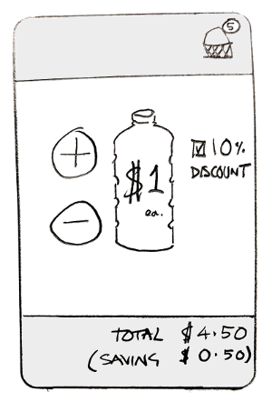
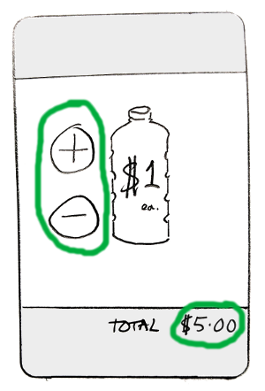
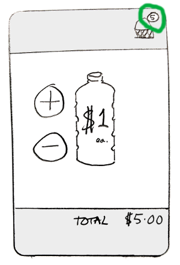
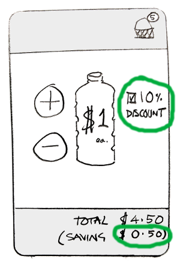

# Reactive UIs

Data Binding is the old term for this, and its basic definition is: any changes of state that happen in your underlying model, get automatically represented in your view.

> "Any changes of state in your underlying model, get automatically represented in your view."

So if your shopping basket model is empty: the checkout button on your view needs to be invisible or disabled. And as soon as your shopping basket model has something in it, your checkout button needs to reflect that by being enabled. This concept is decades old, and in UI frameworks is generally implemented with some form of Observer pattern.

Lately it's been applied to other (non UI) areas of code very successfully under the name of *reactive* programming. Back at the UI layer, you could say that the view is *reacting* to changes in the model.

## SyncView()

MVO uses one of the most simple (but extremely reliable) data binding implementations you can have. It really all boils down to a single **syncView()** method *(the concept is similar to MVI's render() method - compare MVO with MVI [here](https://erdo.github.io/android-fore/00-architecture.html#comparison-with-mvi))*. On the surface it looks very simple, but there are some important details to discuss that can trip you up, or otherwise result in a less than optimal implementation of this method. The basic philosophy is: If a model being observed changes **in any way**, then the **entire** view is refreshed.

That simplicity is surprisingly powerful so we're going to go into further detail about why, after I've quoted myself so that you remember it...

> "If a model being observed changes **in any way**, then the **entire** view is refreshed."

That doesn't mean that you can't subdivide your views and only refresh one of the subviews if you want by the way - as long as both (sub)views have their own syncView() method and they are observing their respective models.

### Quick Tutorial

I've gone through this example with many developers over the last few years, and so far no one has spotted the  **deliberate bug**  that's coming up, until it's too late. So I'm giving you a heads up! The fact that you probably still won't see it, should demonstrate the power of having a syncView() which simply refreshes the **entire** view whenever it's called.

So, let's say we're developing a view for a very basic queue-busting app that lets roaming staff sell $1 bottles of water at a festival. The main UI should look something like this:

We'll assume that the [model](https://erdo.github.io/android-fore/02-models.html#shoom) to support this view has already been written and tested, and it has methods like this:

<!-- Tabbed code sample -->
 

   <button class="tablinks java" onclick="openLanguage('java')">Java</button>
   <button class="tablinks kotlin" onclick="openLanguage('kotlin')">Kotlin</button>
 

<pre class="tabcontent tabbed java"><code>
void addBottle();
void removeBottle();
void setIsDiscounted(boolean isDiscounted);

int getTotalItems();
int getTotalPrice();
boolean getIsDiscounted();
int getTotalSaving();
 </code></pre>

<pre class="tabcontent tabbed kotlin"><code>
fun addBottle()
fun removeBottle()
fun setIsDiscounted(isDiscounted: Boolean)

fun getTotalItems(): Int
fun getTotalPrice(): Int
fun getIsDiscounted(): Boolean
fun getTotalSaving(): Int
 </code></pre>

**Step 1**
Let's start with a basic view.

All we need to do is hook up the **add** and **remove** buttons in the UI and make sure we remember to update the **total price**. Something like this would be typical:

<!-- Tabbed code sample -->
 

   <button class="tablinks java" onclick="openLanguage('java')">Java</button>
   <button class="tablinks kotlin" onclick="openLanguage('kotlin')">Kotlin</button>
 

<pre class="tabcontent tabbed java"><code>
addButton.setOnClickListener(v -> {
    basket.addBottle();
    updateTotalPriceView();
});

removeButton.setOnClickListener(v -> {
    basket.removeBottle();
    updateTotalPriceView();
});
 </code></pre>

<pre class="tabcontent tabbed kotlin"><code>
addButton.setOnClickListener {
    basket.addBottle()
    updateTotalPriceView()
}

removeButton.setOnClickListener {
    basket.removeBottle()
    updateTotalPriceView()
}
 </code></pre>

Inside the **updateTotalPriceView()** call we will just be setting the text in the UI to what the model tells us, essentially: totalPrice.setText(basket.getTotalPrice())

**Step 2**
Now let's get a bit smarter and add an icon in the top right corner that will indicate how many bottles of water we have in the basket

Code-wise this looks pretty similar, we just need to add a call to an **updateTotalNumberOfItemsView()** method, which does what you think it does. Of course, we need to hook that up with the Add and Remove buttons so that they now both call updateTotalPriceView(); and then updateTotalNumberOfItemsView();

<!-- Tabbed code sample -->
 

   <button class="tablinks java" onclick="openLanguage('java')">Java</button>
   <button class="tablinks kotlin" onclick="openLanguage('kotlin')">Kotlin</button>
 

<pre class="tabcontent tabbed java"><code>
addButton.setOnClickListener(v -> {
    basket.addBottle();
    updateTotalPriceView();
    updateTotalNumberOfItemsView();
});

removeButton.setOnClickListener(v -> {
    basket.removeBottle();
    updateTotalPriceView();
    updateTotalNumberOfItemsView();
});
 </code></pre>

<pre class="tabcontent tabbed kotlin"><code>
addButton.setOnClickListener {
    basket.addBottle()
    updateTotalPriceView()
    updateTotalNumberOfItemsView()
}

removeButton.setOnClickListener {
    basket.removeBottle()
    updateTotalPriceView()
    updateTotalNumberOfItemsView()
}
 </code></pre>

**Step 3**
Finally we get to the **discount** checkbox, if the box is checked: the discount is applied, if it's unchecked: the discount is removed.

Remember the basket model calculations have already been written and tested so we only need to worry about the UI code. So for the discount checkbox, we 1) call the model: basket.setIsDiscounted(applyDiscount) and then 2) refresh the UI: **updateTotalSavingsView()** which shows the discount amount that has been applied, and also **updateTotalPriceView()** as that will have changed, but **not updateTotalNumberOfItemsView()** because of course, discounts have no effect there. We end up with something like this:

<!-- Tabbed code sample -->
 

   <button class="tablinks java" onclick="openLanguage('java')">Java</button>
   <button class="tablinks kotlin" onclick="openLanguage('kotlin')">Kotlin</button>
 

<pre class="tabcontent tabbed java"><code>
apply10PercOff.setOnCheckedChangeListener( isChecked -> {
    basket.setIsDiscounted(isChecked);
    updateTotalPriceView();
    updateTotalSavingsView();
});
 </code></pre>

<pre class="tabcontent tabbed kotlin"><code>
apply10PercOff.setOnCheckedChangeListener {
    basket.setIsDiscounted(isChecked)
    updateTotalPriceView()
    updateTotalSavingsView()
}
 </code></pre>

Here is the pseudo code we end up with for this (very over simplified) case:

<!-- Tabbed code sample -->
 

   <button class="tablinks java" onclick="openLanguage('java')">Java</button>
   <button class="tablinks kotlin" onclick="openLanguage('kotlin')">Kotlin</button>
 

<pre class="tabcontent tabbed java"><code>
Button addItemButton;
Button removeItemButton;
CheckBox apply10PercOff;

TextView totalItems;
TextView totalPrice;
TextView totalSaving;

private void setupButtonListeners() {

  addButton.setOnClickListener(v -> {
      basket.addBottle();
      updateTotalPriceView();
      updateTotalNumberOfItemsView();
  });

  removeButton.setOnClickListener(v -> {
      basket.removeBottle();
      updateTotalPriceView();
      updateTotalNumberOfItemsView();
  });

  apply10PercOff.setOnCheckedChangeListener(isChecked -> {
      basket.setIsDiscounted(isChecked);
      updateTotalSavingsView();
      updateTotalPriceView();
  });
}

private void updateTotalNumberOfItemsView(){
    totalItems.setText(basket.getTotalItems());
}

private void updateTotalPriceView(){
    totalPrice.setText(basket.getTotalPrice());
}

private void updateTotalSavingsView(){
    totalSaving.setText(basket.getTotalSaving());
}

private void updatePostRotation(){
    updateTotalNumberOfItemsView();
    updateTotalPriceView();
    updateTotalSavingsView();
}
 </code></pre>

<pre class="tabcontent tabbed kotlin"><code>
lateinit var addItemButton: Button
lateinit var removeItemButton: Button
lateinit var apply10PercOff: CheckBox

lateinit var totalItems: TextView
lateinit var totalPrice: TextView
lateinit var totalSaving: TextView

private fun setupButtonListeners() {

  addButton.setOnClickListener {
      basket.addBottle()
      updateTotalPriceView()
      updateTotalNumberOfItemsView()
  }

  removeButton.setOnClickListener {
      basket.removeBottle()
      updateTotalPriceView()
      updateTotalNumberOfItemsView()
  }

  apply10PercOff.setOnCheckedChangeListener { isChecked ->
      basket.setIsDiscounted(isChecked)
      updateTotalPriceView()
      updateTotalSavingsView()
  }
}

private fun updateTotalNumberOfItemsView() {
    totalItems.text = basket.getTotalItems()
}

private fun updateTotalPriceView() {
    totalPrice.text = basket.getTotalPrice()
}

private fun updateTotalSavingsView() {
    totalSaving.text = basket.getTotalSaving()
}

private fun updatePostRotation(){
    updateTotalNumberOfItemsView()
    updateTotalPriceView()
    updateTotalSavingsView()
}
 </code></pre>

We have the **updatePostRotation()** method there because if we need to rotate this view all the fields will be out of sync with our model. If we hadn't properly separated our view code from our model, we would need to resort to using Android's onSaveInstanceState() style methods, but because we have been smart and separated our model from our view anyway, it's pretty easy and we can just call updatePostRotation().

The code above leaves out a few details of course (the injection of the basket model, hooking up the view elements to the xml layout, formatting the currency displays), but apart from that it looks kind of ok, the add and remove listeners look pretty similar so maybe we could extract them out to another function, but this view would mostly work.

If we wanted to add some more UI details, however, like: disabling a checkout button if there is nothing in the basket, or making the total colour red if it is under the minimum credit card transaction value of $10 or whatever, it soon starts to become untidy and complicated (which is not what you want in a view class which is not easy to test).

### But what about that **BUG** you mentioned?
Well it's right there staring you in the face, see if you can spot it if you haven't already. Do those click listeners look ok to you? cover all the situations fine?

<!-- Tabbed code sample -->
 

   <button class="tablinks java" onclick="openLanguage('java')">Java</button>
   <button class="tablinks kotlin" onclick="openLanguage('kotlin')">Kotlin</button>
 

<pre class="tabcontent tabbed java"><code>
  addButton.setOnClickListener(v -> {
      basket.addBottle();
      updateTotalPriceView();
      updateTotalNumberOfItemsView();
  });

  removeButton.setOnClickListener(v -> {
      basket.removeBottle();
      updateTotalPriceView();
      updateTotalNumberOfItemsView();
  });

  apply10PercOff.setOnCheckedChangeListener(isChecked -> {
      basket.setIsDiscounted(isChecked);
      updateTotalSavingsView();
      updateTotalPriceView();
  });</code></pre>

<pre class="tabcontent tabbed kotlin"><code>
  addButton.setOnClickListener {
      basket.addBottle()
      updateTotalPriceView()
      updateTotalNumberOfItemsView()
  }

  removeButton.setOnClickListener {
      basket.removeBottle()
      updateTotalPriceView()
      updateTotalNumberOfItemsView()
  }

  apply10PercOff.setOnCheckedChangeListener { isChecked ->
      basket.setIsDiscounted(isChecked)
      updateTotalPriceView()
      updateTotalSavingsView()
  }</code></pre>

This is a class of bug related to UI consistency that crops up *all the time* in any code that doesn't have proper data binding, and that means it's a class of bugs that crops up *all the time* in android apps, even ones that disable rotation.

In case you haven't worked out the bug yet, you can recreate it in your brain like this (focus on the amount in the savings field):

* start with an empty basket
* select the discount checkbox first
* then add an item

It's that simple. The add and remove item click listeners will correctly talk to the model, so the model state is correct. However the developer forgot to call *updateDiscountView()* from the add and remove click listeners, so the savings value will be incorrect in the view until the discount checkbox is toggled again.

Even simple views can very easily have subtle UI consistency bugs like this. And often they are **hard to spot**. In this case, a tester would have had to have performed specific actions **in the right sequence** even to see it. Luckily there is a simple solution and all you have to do is apply it everywhere you have a view.

Remember what we said before? If a model being observed changes **in anyway**, then the **entire** view is refreshed. Using the syncView() convention, we instead end up with something like this:

<!-- Tabbed code sample -->
 

   <button class="tablinks java" onclick="openLanguage('java')">Java</button>
   <button class="tablinks kotlin" onclick="openLanguage('kotlin')">Kotlin</button>
 

<pre class="tabcontent tabbed java"><code>
Button addItemButton;
Button removeItemButton;
CheckBox apply10PercOff;

TextView totalItems;
TextView totalPrice;
TextView totalSaving;

private void setupButtonListeners() {

  addButton.setOnClickListener(v -> {
      basket.addBottle();
  });

  removeButton.setOnClickListener(v -> {
      basket.removeBottle();
  });

  apply10PercOff.setOnCheckedChangeListener(isChecked -> {
      basket.setIsDiscounted(isChecked);
  });
}

public void syncView(){
    totalItems.setText(basket.getTotalItems());
    totalPrice.setText(basket.getTotalPrice());
    totalSaving.setText(basket.getTotalSaving());
}
 </code></pre>

<pre class="tabcontent tabbed kotlin"><code>
lateinit var addItemButton: Button
lateinit var removeItemButton: Button
lateinit var apply10PercOff: CheckBox

lateinit var totalItems: TextView
lateinit var totalPrice: TextView
lateinit var totalSaving: TextView

private fun setupButtonListeners() {

  addButton.setOnClickListener {
      basket.addBottle()
  }

  removeButton.setOnClickListener {
      basket.removeBottle()
  }

  apply10PercOff.setOnCheckedChangeListener { isChecked ->
      basket.setIsDiscounted(isChecked)
  }
}

fun syncView() {
    totalItems.text = basket.getTotalItems()
    totalPrice.text = basket.getTotalPrice()
    totalSaving.text = basket.getTotalSaving()
}
 </code></pre>

Surprisingly, this is not only **more robust**, it's also **less code**. And because this technique supports almost all types of standard UI (including [adapters](https://erdo.github.io/android-fore/04-more-fore.html#adapters-notifydatasetchangedauto)), the code becomes so familiar, it makes it very easy to spot when something is wrong. **And we get rotation support for free: all we need to do to is to call syncView() after rotating.**

We haven't discussed yet how syncView() actually gets called by the model, see the [**hooking it all up**](#hooking-it-all-up) section below. For the moment all we need to know is that syncView() is triggered whenever **any** state of the basket model changes. It's also called when the view is created, including after rotation.

 A full implementation of a view is not that much larger with those details included, see [here](https://github.com/erdo/android-fore/blob/master/example01databinding/src/main/java/foo/bar/example/foredatabinding/ui/wallet/WalletsView.java) and [here](https://github.com/erdo/android-fore/blob/master/example02threading/src/main/java/foo/bar/example/forethreading/ui/CounterView.java) for example views from the sample apps.

> "It's not only more robust - it's also less code... and we get rotation support for free"

If you want to add any more states it's also easy and clean, and totally consistent if they are set inside the syncView() method:

<!-- Tabbed code sample -->
 

   <button class="tablinks java" onclick="openLanguage('java')">Java</button>
   <button class="tablinks kotlin" onclick="openLanguage('kotlin')">Kotlin</button>
 

<pre class="tabcontent tabbed java"><code>
public void syncView(){
    checkoutButton.setEnabled(basket.isAboveMinimum());
    totalPrice.setColour(basket.isAboveMinimum() ? black : red);
    removeButton.setEnabled(basket.getTotalItems>0);
    totalItems.setText(basket.getTotalItems());
    totalPrice.setText(basket.getTotalPrice());
    totalSaving.setText(basket.getTotalSaving());
}
 </code></pre>

<pre class="tabcontent tabbed kotlin"><code>
fun syncView(){
    checkoutButton.enabled = basket.isAboveMinimum()
    totalPrice.color = if (basket.isAboveMinimum()) black else red
    removeButton.enabled = basket.getTotalItems>0
    totalItems.text = basket.getTotalItems()
    totalPrice.text = basket.getTotalPrice()
    totalSaving.text = basket.getTotalSaving()
}
 </code></pre>

### Writing an effective syncView() method

As part of refreshing the entire view, the syncView() method must set an **affirmative state** for every view element property that you are interested in. What that means is that where there is an **if** there must always be an **else** for each property.

> "Where there is an if, there must always be an else"

It's not good enough to just set a button as **disabled** if a total is 0 or less. You must also set that button as **enabled** if the total is greater than 0. If you don't set an affirmative step for both the positive and negative scenarios, then you run the risk of a syncView() call not setting a state at all, which means that the result will be indeterministic (it will be whatever state it had previously). This is one of those sneaky edge case things that at first glance might look fine, but can reveal itself as a bug later.

So don't do this:

<!-- Tabbed code sample -->
 

   <button class="tablinks java" onclick="openLanguage('java')">Java</button>
   <button class="tablinks kotlin" onclick="openLanguage('kotlin')">Kotlin</button>
 

<pre class="tabcontent tabbed java"><code>
if (basket.isBelowMinimum()){
    checkoutButton.setEnabled(false);
    totalPrice.setColour(red);
}
 </code></pre>

<pre class="tabcontent tabbed kotlin"><code>
if (basket.isBelowMinimum()){
    checkoutButton.enabled = false
    totalPrice.color = red
}
 </code></pre>

At the very least you must do this:

<!-- Tabbed code sample -->
 

   <button class="tablinks java" onclick="openLanguage('java')">Java</button>
   <button class="tablinks kotlin" onclick="openLanguage('kotlin')">Kotlin</button>
 

<pre class="tabcontent tabbed java"><code>
if (basket.isBelowMinimum()){
    checkoutButton.setEnabled(false);
    totalPrice.setColour(red);
} else {
    checkoutButton.setEnabled(true);
    totalPrice.setColour(black);
}
 </code></pre>

<pre class="tabcontent tabbed kotlin"><code>
if (basket.isBelowMinimum()){
    checkoutButton.enabled = false
    totalPrice.color = red
} else {
    checkoutButton.enabled = true
    totalPrice.color = black
}
 </code></pre>

But you'll find that by focusing on the property first rather than the condition, you can get some extremely tight code like so:

<!-- Tabbed code sample -->
 

   <button class="tablinks java" onclick="openLanguage('java')">Java</button>
   <button class="tablinks kotlin" onclick="openLanguage('kotlin')">Kotlin</button>
 

<pre class="tabcontent tabbed java"><code>
checkoutButton.setEnabled(!basket.isBelowMinimum());
totalPrice.setColour(basket.isBelowMinimum() ? red : black);
 </code></pre>

<pre class="tabcontent tabbed kotlin"><code>
checkoutButton.enabled = !basket.isBelowMinimum()
totalPrice.color = if (basket.isBelowMinimum()) red else black
 </code></pre>

*A lot of this advice also applies to writing MVI render() methods. MVO's reducer() function helps to maintain state consistency, but it won't matter if the render() method written in the view layer doesn't set an affirmative state for each UI element.*

### Don't Count Notifications
Be careful not to rely on syncView() being called a certain number of times, as it results in fragile code. Make sure you understand [this](https://erdo.github.io/android-fore/05-extras.html#notification-counting) and you'll be writing solid syncView() implementations that will survive code refactors.

### Infinite loops
On final point to mention about syncing your view directly from UI element "changed" listeners. It's generally fine to do that, and you should be able to call syncView() whenever you like after all.

However, if you set a state on that UI element during your syncView() (which would be typical), and that UI element then calls its "changed" listener, you will end up calling SyncView() again and find yourself in an infinite loop.

Of course, if you're setting a state on a UI element which is the same as the state it already had, it shouldn't be firing it's "changed" listeners anyway. But Android. And indeed EditText calls afterTextChanged() even when the text is identical to what it had before. Thankfully it's not a very common issue and the [work around](https://github.com/erdo/android-architecture/blob/todo-mvo/todoapp/app/src/main/java/com/example/android/architecture/blueprints/todoapp/ui/widget/CustomEditText.java) is easy.

## **fore** Observables
In MVO, the models are usually Observable, and the Views are mostly doing the Observing.

Most of the models in the sample apps become observable by extending ObservableImp (you can also implement the Observable interface and proxy the methods through to an ObservableImp instance), the [code](https://github.com/erdo/android-fore/blob/master/fore-core/src/main/java/co/early/fore/core/observer/ObservableImp.java) is pretty light weight and you can probably work out what it's doing. By extending ObservableImp, the models gain the following characteristics:

- Any observers (usually views) can add() themselves to the model so that the **observer will be told of any changes in the model's state**
- When the model's state changes, each added observer will be told in turn by having its **somethingChanged()** method called (which in turn typically causes a call to **syncView()**)
- For this to work, all a model must do is call **notifyObservers()** whenever its own state changes (see the [Model](https://erdo.github.io/android-fore/02-models.html#shoom) section)
- When the model is constructed in **ASYNCHRONOUS** mode, these notifications will always be delivered on the UI thread so that view code need not do anything special to update the UI
- To avoid memory leaks, **views are responsible for removing their observable callback** from the observable model once they are no longer interested in receiving notifications
- Typically Views **add()** and **remove()** their observer callbacks in android lifecycle methods such as View.onAttachedToWindow() and View.onDetachedFromWindow()
- The fact that the **fore** observable contract has no parameter means that this view layer code is extremely sparse, even if a View is Observing multiple Models, only a single observable is required.

## Hooking it all up

So basically, somewhere in the view layer (Activity/Fragment/View) there will be a piece of code like this:

<!-- Tabbed code sample -->
 

   <button class="tablinks java" onclick="openLanguage('java')">Java</button>
   <button class="tablinks kotlin" onclick="openLanguage('kotlin')">Kotlin</button>
 

<pre class="tabcontent tabbed java"><code>
Observer observer = new Observer() {
    public void somethingChanged() {
        syncView();
    }
};
 </code></pre>

<pre class="tabcontent tabbed kotlin"><code>
var observer: Observer = object : Observer() {
    fun somethingChanged() {
        syncView()
    }
}
 </code></pre>

Or a bit tighter with Java 8 or Kotlin, the rather lovely:

<!-- Tabbed code sample -->
 

   <button class="tablinks java" onclick="openLanguage('java')">Java 8</button>
   <button class="tablinks kotlin" onclick="openLanguage('kotlin')">Kotlin</button>
 

<pre class="tabcontent tabbed java"><code>
Observer observer = this::syncView;
 </code></pre>

<pre class="tabcontent tabbed kotlin"><code>
internal var observer = this::syncView
 </code></pre>

And in line with android lifecycle methods (of either the Activity, the Fragment or the View), this observer will be an added and removed accordingly *(in this case we are observing two models: wallet and account, and we are using View lifecycle methods to do it)*:

<!-- Tabbed code sample -->
 

   <button class="tablinks java" onclick="openLanguage('java')">Java</button>
   <button class="tablinks kotlin" onclick="openLanguage('kotlin')">Kotlin</button>
 

<pre class="tabcontent tabbed java"><code>
@Override
protected void onAttachedToWindow() {
    super.onAttachedToWindow();
    wallet.addObserver(observer);
    account.addObserver(observer);
    syncView(); //  <- don't forget this
}

@Override
protected void onDetachedFromWindow() {
    super.onDetachedFromWindow();
    wallet.removeObserver(observer);
    account.removeObserver(observer);
}
 </code></pre>

<pre class="tabcontent tabbed kotlin"><code>
override fun onAttachedToWindow() {
    super.onAttachedToWindow()
    wallet.addObserver(observer)
    account.addObserver(observer)
    syncView() //  <- don't forget this
}

override fun onDetachedFromWindow() {
    super.onDetachedFromWindow()
    wallet.removeObserver(observer)
    account.removeObserver(observer)
}
 </code></pre>

## Removing even more boiler plate

To save yourself writing even that minimal databinding boiler plate, you can use the optional **fore-lifecycle** package which gives you access to classes that do the adding and removing for you ([SyncableAppCompatActivity](https://github.com/erdo/android-fore/blob/master/fore-lifecycle/src/main/java/co/early/fore/lifecycle/activity/SyncableAppCompatActivity.java), [SyncableActivity](https://github.com/erdo/android-fore/blob/master/fore-lifecycle/src/main/java/co/early/fore/lifecycle/activity/SyncableActivity.java), [SyncableSupportFragment](https://github.com/erdo/android-fore/blob/master/fore-lifecycle/src/main/java/co/early/fore/lifecycle/fragment/SyncableSupportFragment.java), [SyncableFragment](https://github.com/erdo/android-fore/blob/master/fore-lifecycle/src/main/java/co/early/fore/lifecycle/fragment/SyncableFragment.java)) At that point the code starts to become so sparse that it's almost hard to see what is going on, I'm on the fence about whether that's a good thing or not.

[Example app 5](https://erdo.github.io/android-fore/#fore-5-ui-helpers-example-tic-tac-toe) does this, see the **getResourceIdForSyncableView()** and **getThingsToObserve()** implementations of the [TicTacToeActivity](https://github.com/erdo/android-fore/blob/master/example05ui/src/main/java/foo/bar/example/foreui/ui/tictactoe/TicTacToeActivity.java) then notice how the usual add()/remove() observable boiler plate is missing from the [TicTacToeView](https://github.com/erdo/android-fore/blob/master/example05ui/src/main/java/foo/bar/example/foreui/ui/tictactoe/TicTacToeView.java)

That's everything you need to do to get bullet proof data binding in your app, everything now takes care of itself, no matter what happens to the model or the rotation state of the device.

The remaining code in this [example view](https://github.com/erdo/android-fore/blob/master/example02threading/src/main/java/foo/bar/example/forethreading/ui/CounterView.java) should now make sense to you.
