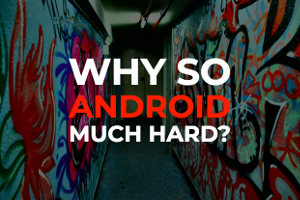
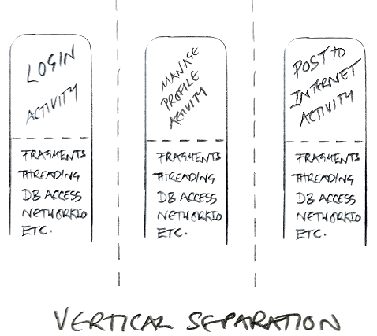
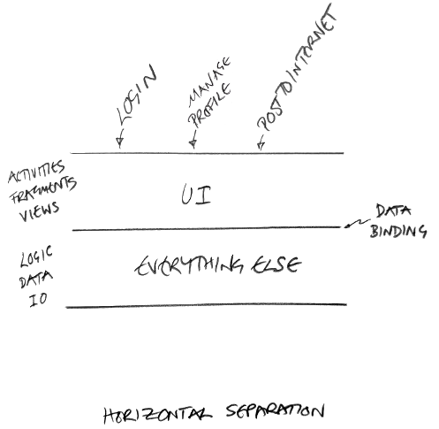

# Presentations

There are a couple of presentations hosted on surge that I occasionally use, they might be useful for you too. Ironically they don't work at all on mobile.

They were written using [spectacle](https://github.com/FormidableLabs/spectacle) which is a pretty good ReactJS presentation library.

### State versus Events at the UI layer

Compares the two main strategies used when updating a view: using events (MVP, MVC) and using state (MVO, MVI, MvRx).

<strong>Presenter perspective including notes is [here](http://fore-ui.surge.sh/#/?presenter&timer)</strong>

<strong>Regular slides without notes is [here](http://fore-ui.surge.sh)</strong>

(if you open those two links on separate tabs of the same browser, the slides will automatically keep themselves in sync)

### Android architecture basics

This spells out the main problem with the default android architecture and the motivation for using libraries like **fore** in the first place.

<strong>Presenter perspective including notes is [here](http://android-arch.surge.sh/#/?presenter&timer)</strong>

<strong>Regular slides without notes is [here](http://android-arch.surge.sh)</strong>

(if you open those two links on separate tabs of the same browser, the slides will automatically keep themselves in sync)

### **fore** basics

This one takes you though all the main points of **fore** together with a lot of examples. I don't think it really adds anything that isn't already in these docs - it's like a quick summary version.

<strong>Presenter perspective including notes is [here](http://android-fore.surge.sh/#/?presenter&timer)</strong>

<strong>Regular slides without notes is [here](http://android-fore.surge.sh)</strong>

(Again, if you open those two links on separate tabs of the same browser, the slides will automatically keep themselves in sync)

# State versus Events
This is quite subtle but the issue presents itself in many different architectures, so I think it's worth saying a few things about it. You can choose to treat any of your applications data as state or an event. The choice you make will effect how straight forward it is to handle that data, and how clear your resulting code is.

Let's take the example of a network error.

If you choose to treat the network error as **state**, then in MVO style, somewhere you will have a getter in a model that exposes this error state, maybe it returns ERROR_NETWORK. It will return this ERROR_NETWORK object via the getter until the model changes (perhaps when you make another network call: that error state will be cleared, the observers notified, and the model's getter will now return a ERROR_NONE object when syncView() is next run). Similarly in MVI style, the ViewState will have an error field that will be ERROR_NETWORK and then after the error state has been cleared, the field will be ERROR_NONE in the next render() pass.

Now let's think about the UI that might represent that error. Maybe when you are in the error state, you want a warning icon to display. Now let's say we rotate the screen (it's often helpful to think about what would happen during a screen rotation because it can be representative of a lot of other situations). After a rotation you  still want to see the warning icon, because that's the current state, and you never want your view to lie. Other things can cause the view to re-sync itself and likewise you don't want that warning icon to disappear just because of a syncView() / render() call. The only time you want that warning icon to not be visible, is when the error state has actually been reset to ERROR_NONE by some logic processing away from the view layer.

Looks like choosing to store our error as state was the right move here.

Now let's consider another UI style, one where we display a temporary toast message or a snackbar when we encounter an error. That's a pretty common way of handling network errors. When the syncView() or render() method is called we notice the presence of ERROR_NETWORK and we show a toast message accordingly. How about when we rotate the screen? Well when the view is re-synced with the state of the app we will show that toast again, in fact anything that causes the view to be re drawn will cause that toast to appear again - multiple toasts for the same error is definitely not what we want. It's not the end of the world, there are a number of ways to handle this, in **fore** you would use a  [syncTrigger](https://erdo.github.io/android-fore/04-more-fore.html#synctrigger) that bridges the two worlds of state and events, letting you fire one off events only as a result of a state *change*. But anyway, for this style of UI maybe we chose the wrong way of representing our error here. By treating our error as an **event** rather than a state of our view, we can just use a callback to fire a toast message and our code will likely end up a lot simpler.

After all, a network error relates to a single point in time, if we loose it on rotation does it really matter? maybe it does, maybe it doesn't - maybe you want to treat everything as state just for consistency. That's where you need to make a decision about state versus event.

This comes up a lot with displaying menus, popups, errors and running animations. There is a little more on that here: [When should I use an Observer, when should I use a callback listener?](https://erdo.github.io/android-fore/05-extras.html#observer-listener)

# Android's Original Mistake

Separating view code from everything else is widely considered a good thing, but despite that agreement, it's rare to come across an android app that actually does that.

Unfortunately, right from its inception the Android platform was developed with almost no consideration for data binding or for a separation between view code and testable business logic, and that legacy remains to this day.

Instead of separating things *horizontally* in layers with views in one layer and data in another layer, the Android designers separated things *vertically*. Each self contained Activity (incorporating UI, data and logic) wrapped up in its own little reusable component. That's also probably why testing was such an afterthought for years with Android - if you architect your apps like this, testing them becomes extremely difficult.

Android seems to have been envisioned a little like this:

A more standard way of looking at UI frameworks would have been to do something like this:

I know, crap diagrams, but anyway a lot of the complication of Android development comes from treating the Activity class as some kind of reusable modular component and not as a thin view layer (which is what it really is).  Hacks like onSaveInstanceState() etc, are the result of fundamentally missing the basic requirement of (all?) UI platforms: the need to separate the view layer from everything else.

Despite the obvious problems of writing networking code or asynchronous code inside an ephemeral view layer, think about how many Android apps you've encountered that fill their Activity and Fragment classes with exactly that. And think about how much additional code is then required to deal with a simple screen rotation (or worse, how many apps simply disable screen rotation because of the extra headache). Sometimes even smart developers can fail to see the wood for all the trees.

Fortunately it's almost all completely unecessary. The [sample apps](https://erdo.github.io/android-fore/#sample-apps) should clearly demonstrate just how clean android code can become once you start properly separating view code from everything else.

# Troubleshooting / How to Smash Code Reviews
Android apps that are written using **fore** have a certain *look* to them code-wise, the code in these docs and the sample apps looks very similar. This really helps when performing code reviews because structural errors tend to jump out at you a little more. The first part of this [**post**](https://www.joelonsoftware.com/2005/05/11/making-wrong-code-look-wrong/) explains the concept better than I could, and I'd recommend you give it a quick read.

## Typical characteristics of an app built with **fore**

- **The package structure** tends to contain two main packages (among others): **features** (which is usually straight forward testable code) and **ui** (which can only be tested with tools like Espresso or Robolectric). Examples: [here](https://github.com/erdo/fore-full-example-02-kotlin/tree/master/app/src/main/java/foo/bar/example/fore/fullapp02), [here](https://github.com/erdo/android-fore/tree/master/example-kt-04retrofit/src/main/java/foo/bar/example/foreretrofitkt) and [here](https://github.com/erdo/android-fore/tree/master/example-jv-06db/src/main/java/foo/bar/example/foredb)
- **Activity and Fragment classes tend to be very light** and won't contain a lot of code in them. They are part of the [view layer](https://erdo.github.io/android-fore/01-views.html#shoom) after all. Examples: [here](https://github.com/erdo/android-architecture/blob/todo-mvo/todoapp/app/src/main/java/com/example/android/architecture/blueprints/todoapp/ui/taskdetail/TaskDetailFragment.java), [here](https://github.com/erdo/android-fore/blob/master/example-jv-04retrofit/src/main/java/foo/bar/example/foreretrofit/ui/fruit/FruitActivity.java) and [here](https://github.com/erdo/android-fore/tree/master/example-kt-02coroutine/src/main/java/foo/bar/example/forecoroutine/ui/CounterActivity.kt)
- **The View classes follow a very standard flow** which is: get a reference to UI components -> inject model dependencies -> setup click listeners/adapters etc -> setup any animations if needed -> make the ui reactive by adding and removing an observer and using a syncView method.

Given any app that is attempting to implement **fore**: first check the package structure, then investigate one of the activities and/or fragments to check it's as small as it can be. Next take a look at a UI class to see if you recognise the flow mentioned above. Check the reactive behaviour especially i.e. is an observer being added and removed, how does the syncView method look. Look out for any UI state being set outside of the syncView method. It should take seconds to establish if the project is approximately correct and has a chance of the UI remaining consistent, handling rotations and not having memory leaks. Further to that, here is a list of specific warning signs that will highlight potentially incorrect code (this list is especially helpful for code reviews - these are all things I have seen professional developers do).

 1) **Any code which is setting or updating view states that is not inside the syncView() method**. Example: "clickListener -> setDisabled". That's a very common pattern in MVP (and it makes handling rotation hard), in MVO it's usually an indication that the developer might not understand why syncView() is designed like it is, and will almost certainly result in hard to identify UI consistency bugs when screens are rotated etc. Point them to the reactive ui section where it talks about [syncView()](https://erdo.github.io/android-fore/03-reactive-uis.html#syncview).

 2) **Activities and Fragments that have anything in them (other than the standard flow of a UI layer component)**. Sometimes there are good reasons for putting code in Activities and Fragments, setting up bundles and intents is often unavoidable for example, but you should be immediately suspicious of any errant code that gets into these classes. Often this code can be moved to a model class, safely away from tricky lifecycle issues and where it can also be more easily tested. (If you value your sanity and that of your team, you should make sure that there are absolutely **no** AsyncTask instances or networking code in any Activity or Fragment classes at all. Ever.)

 3) **Code in a Fragment that casts it's parent activity and then calls that activity for further processing**. Again sometimes that is appropriate, but unfortunately it's a very common pattern that is often misused. The idea of course is to let a Fragment communicate with an Activity in a safe way. Generally if you have two **ephemeral** view layer components talking to each other, it's going to cause problems. When this technique is used as a way to access functionality written in the parent activity which should really have been written in a model class in the first place, it just acts as a sticking plaster for a problem that should never have existed anyway. The answer of course is to put that code in a model, inject that model into the fragment and let the fragment access it directly, that totally removes the dependence on the host Activity and removes a lot of boiler plate in the process.

 4) **Adding or removing observers outside of android lifecycle methods**. I'm not saying there is never a good reason to do that (particularly if you want to set up one long living model to observe the state of another long living model). But it is a bit unusual and might warrant a rethink. It's usually a mistake (and a cause of memory leaks).

 5) Wherever you see an **addObserver()** it's always worth checking that you can see the associated **removeObserver()** call in the mirrored lifecycle method (eg. onStart()/onStop() or onResume()/onPause()) to make sure references are being cleaned up and memory isn't being leaked.

 6) **Any change of state in an observable model that doesn't end with a call to notifyObservers()**. Even if it's not necessary for the current implementation, by not notifying the observers here, we now have a model that only works in certain (undocumented) circumstances. If someone else comes along and wants to observe your model and does not get a notification as expected when some state changes, something will break.

 7) **Any getter method that does more than pass back an in-memory copy of the data asked for**. In order for the reactive UI to be performant, we want any getter methods to return fairly quickly. Try to front load any processing rather than doing it in the getters.

 8) **Any observers that do anything other than sync their entire view** are usually (but not always) incorrect. Generally the observer just does one thing (sync the view), and this means you can use the same instance of that observer to register with several different models in the same view.

 9) **Code or tests that makes assumptions about the number of times syncView() or somethingChanged() will be called** This is pretty important, you can't simply fire one off events based on syncView() being called (like starting an activity for example) - because you are depending on being notified by the model an exact number of times. Code like that can easily break in two ways:
* 1) If the **model** is later refactored to contain some other piece of state that changes, it will result in an additional notification, and therefore call to syncView(), that your view was not prepared for.
* 2) If the **view** is later refactored to observe an additional model, that additional model will also notify when its state changes, and you will get more syncView() calls than you were prepared for.

*The deal is that whenever something (anything) changes in a model, you will be notified. But you maybe be notified more than you expect. In order to be robust, your syncView() must make no assumptions about the number of times it may or may not be called. Sometimes you will of course need to bridge the world of syncing views and triggering one off events, and the way you do that in fore is to use [SyncTrigger](https://erdo.github.io/android-fore/04-more-fore.html#synctrigger). Also take a look at [this](https://erdo.github.io/android-fore/05-extras.html#observer-listener) in case what you really want is a callback anyway.*

 10) **A syncView() that is more than 5-10 lines long or so and/or doesn't have one line to set an affirmative value for each property of each UI element you are concerned with**. Take a look at how to write a good [syncView()](https://erdo.github.io/android-fore/03-reactive-uis.html#syncview) method under the data binding section.

 11) **Any click listeners or text change listeners should generally be talking directly to model classes, or asking for navigation operations** for example: MyActivity.startMe(getContext()). Occasionally it's useful for listeners to directly call syncView() to refresh the view (when an edit text field has changed for example). What they generally shouldn't be doing is accessing other view components like fragments or activities and checking their state in some way. Sometimes if you follow this code it ends up calling a model class somewhere down the line anyway, in which case the model class should just be called directly (you get your model references to any view class using [dependency injection](https://erdo.github.io/android-fore/05-extras.html#dependency-injection-basics))

 12) **Public methods on models that return their state directly through a callback, and therefore shortcut the MVO pattern**. Depending on what data is returned here, this may make it difficult to cleanly support rotation. It might be worth re-reading the [**MVO architecture page**](https://erdo.github.io/android-fore/00-architecture.html#shoom) and the [reactive UIs](https://erdo.github.io/android-fore/03-reactive-uis.html#shoom) page.

 13) **Any state kept in view layer classes is at risk of being lost**. How does this view survive rotation, would loosing that state matter? if yes, then it might be better kept inside a model, away from the view layer. Take a glance at the [**state versus events**](https://erdo.github.io/android-fore/05-extras.html#state-versus-events) discussion.

 14) **Any logic kept in view layer classes is usually harder to test**. It can be hard to totally remove all the logic from the view layer (especially navigational logic once you factor in the back button) but be aware that the logic here is usually a lot harder to test and if you can move it away from the view layer reasonably easily, then you probably should. If there is some particularly complicated logic for a view state in the syncView() method for example, that logic is a prime candidate to be moved out of the view layer into a model or utility class where it can be tested more easily.

 15) **Having a syncView() method, but not calling it syncView()**. This specific method is talked about a lot and it's very handy to call it the same thing so that everyone knows what everyone else is talking about. Making your View implement [SyncableView](https://github.com/erdo/android-fore/blob/master/fore-core/src/main/java/co/early/fore/core/ui/SyncableView.java) is probably a good idea anyway, it's also a requirement to use the optional lifecycle classes.

# Dependency Injection Basics

Dependency Injection is pretty important, without it I'm not sure how you could write a properly tested Android app. But it's not actually that complicated.

All it really means is instead of instantiating the things that you need to use (dependencies) inside of the class that you're currently in, pass them **to** your class instead (either via the constructor or some other method if the constructor is not available such as with the Android UI classes).

Don't do this:

<!-- Tabbed code sample -->
 

   <button class="tablinks java" onclick="openLanguage('java')">Java</button>
   <button class="tablinks kotlin" onclick="openLanguage('kotlin')">Kotlin</button>
 

<pre class="tabcontent tabbed java"><code>
public MessageSender() {
    networkAccess = new NetworkAccess();
}
 </code></pre>

<pre class="tabcontent tabbed kotlin"><code>
fun MessageSender() {
    networkAccess = NetworkAccess()
}
 </code></pre>

Do this instead

<!-- Tabbed code sample -->
 

   <button class="tablinks java" onclick="openLanguage('java')">Java</button>
   <button class="tablinks kotlin" onclick="openLanguage('kotlin')">Kotlin</button>
 

<pre class="tabcontent tabbed java"><code>
public MessageSender(NetworkAccess networkAccess) {
    this.networkAccess = networkAccess;
}
 </code></pre>

<pre class="tabcontent tabbed kotlin"><code>
fun MessageSender(networkAccess: NetworkAccess) {
    this.networkAccess = networkAccess
}
 </code></pre>

If you don't have access to the constructor, you can do this (like we do in a lot of the **fore** sample apps):

<!-- Tabbed code sample -->
 

   <button class="tablinks java" onclick="openLanguage('java')">Java</button>
   <button class="tablinks kotlin" onclick="openLanguage('kotlin')">Kotlin</button>
 

<pre class="tabcontent tabbed java"><code>
MessageSender messageSender;

protected void onFinishInflate() {
    super.onFinishInflate();

    messageSender = CustomApp.get(MessageSender.class);
}
 </code></pre>

<pre class="tabcontent tabbed kotlin"><code>
private lateinit var messageSender: MessageSender

override fun onFinishInflate() {
    super.onFinishInflate()

    messageSender = CustomApp.get(MessageSender::class.java)
}
 </code></pre>

In a commercial app, the number of dependencies you need to keep track of can sometimes get pretty large, so some people use a library like Dagger2 to manage this:

<!-- Tabbed code sample -->
 

   <button class="tablinks java" onclick="openLanguage('java')">Java</button>
   <button class="tablinks kotlin" onclick="openLanguage('kotlin')">Kotlin</button>
 

<pre class="tabcontent tabbed java"><code>
@Inject MessageSender messageSender;

protected void onFinishInflate() {
    super.onFinishInflate();

    DaggerComponent.inject(this);
}
 </code></pre>

<pre class="tabcontent tabbed kotlin"><code>
private lateinit var messageSender: MessageSender

override fun onFinishInflate() {
    super.onFinishInflate()

    DaggerComponent.inject(this)
}
 </code></pre>

The main reason for all of this is that dependency injection enables you to swap out that NetworkAccess dependency (or swap out MessageSender) in different situations.

Maybe you want to swap in a mock NetworkAccess for a test so that it doesn't actually connect to the network when you run the test. If NetworkAccess is an interface, dependency injection would let you replace the entire implementation with another one without having to alter the rest of your code.

A quick way to check how your Java code is doing on this front is to look for the keyword ***new*** (it's slightly less obvious in Kotlin as there is no *new* keyword). If you are instantiating an object, then that is a dependency that won't be able to be swapped or mocked out at a later date (which may be fine, as long as you are aware of it).

*Incidentally don't let anyone tell you that you must use a dependency injection framework in your android app. In the fore sample apps, all the dependencies are managed in the OG(ObjectGraph) class and managing even 100 dependencies in there is no big deal (if you have a mobile app with more than 100 global scope dependencies then it's possible you're doing something wrong anyway). Keeping them all in the same place also lets you see what your dependency graph actually looks like at a glance. So if you and your team dig dagger, then use it. But if you spent a few days stabbing yourself in the eye with it instead - feel free to manage those dependencies yourself. See [here](http://blog.ploeh.dk/2014/06/10/pure-di/) for more on this*

### Inversion of Control

This term really confused me when I first heard it years ago, so here's my take in case it's helpful for you.

Imagine if we have a company. It has a CEO at the top. Underneath the CEO are departments like Marketing, HR, Finance. Those departments all print documents using a printer.

The CEO is in control of the whole lot, whatever she says goes. But if you took that to extremes it would be ridiculous. The CEO would tell the departments exactly what documents to print, but also with what paper, and what printer ink. When paper tray 3 ran out, the CEO would be the one to decide to switch to using paper tray 2 instead, or to display an error on the printer display. After 5 minutes of no printing, the CEO would decide to put the printer into power saving mode. You get the idea. Don't write software like that.

Inversion of control means turning that control on its head and giving it to the lower parts of the system. Who decides when to enter power saving mode on the printer? the printer does, it has control. And the printer wasn't manufactured in the office, it was made elsewhere and "injected" into the office by being delivered. Sometimes it gets swapped out for a newer model that prints more reliably. Write software like that.

### Global vs Local scope dependencies and rotation

Most of the models used in **fore** (the dependencies in this case) tend to be global in scope i.e. they exist throughout the lifetime of the app. A good example would be an **AccountModel** with methods such as **login(), logout(), isLoggedIn(), isCurrentlyPerformingNetworkAccess(), getUserName()** etc. This means they will maintain any state they have (such as whether they are currently performing network access or not) independent of anything that is happening in the view layer.

This of course means that when a view is rotated, it makes no difference to the model.

For locally scoped models Google's ViewModel offers a great [solution](https://github.com/erdo/fore-full-example-02-kotlin/blob/master/app/src/main/java/foo/bar/example/fore/fullapp02/feature/basket/BasketModel.kt) and with libraries like Koin, it becomes trivial to inject this into a [view](https://github.com/erdo/fore-full-example-02-kotlin/blob/master/app/src/main/java/foo/bar/example/fore/fullapp02/ui/basket/BasketFragment.kt).

# ~~Frequently~~ Occasionally Asked Questions

##  1) When should I use an Observer, when should I use a callback listener?

The observer / notify pattern is not always going to be suitable for what you want to do. In particular, if you are looking to receive a one off success/fail result from a model as a direct result of the model performing some operation (like a network request) then a regular callback may serve you better. In this case the success or failure of the network call does not alter any fundamental state of the model, so a callback / listener is ideal. *This means that the success / fail callback may be lost if the device is rotated - if that's a problem, then you'll need to treat things as state and use the Observer pattern*. More about how to treat state [**here**](https://erdo.github.io/android-fore/05-extras.html#state-versus-events).

for example, calling model code from the UI layer:

<!-- Tabbed code sample -->
 

   <button class="tablinks java" onclick="openLanguage('java')">Java</button>
   <button class="tablinks kotlin" onclick="openLanguage('kotlin')">Kotlin</button>
 

<pre class="tabcontent tabbed java"><code>
model.doStuffOnAThread(new ResultListener{
    @Override
    public void success(){
        //do next thing
    }
    @Override
    public void fail(UserMessage reason){
        showMessage(reason);
    }
});
 </code></pre>
<pre class="tabcontent tabbed kotlin"><code>
model.doStuffOnAThread(
    success = {
      //do next thing
    }
    fail = { reason ->
      showMessage(reason)
    }
)
 </code></pre>

You can use both patterns in the same model with no problem of course, in the example above, the model could have a busy state that changes from false to true and back to false again during a network request so that view code can redraw itself as showing a busy swirly if appropriate. That would be better managed using the observer pattern. The model could implement the method like this:

<!-- Tabbed code sample -->
 

   <button class="tablinks java" onclick="openLanguage('java')">Java</button>
   <button class="tablinks kotlin" onclick="openLanguage('kotlin')">Kotlin</button>
 

<pre class="tabcontent tabbed java"><code>
public void doStuffOnAThread(final ResultListener resultListener){

    busy = true;
    notifyObservers();

    startAsyncOperation(new FinishedListener(){
        @Override
        public void finished(){
            busy = false;
            resultListener.success();
            notifyObservers();
        }
    });
}
 </code></pre>

<pre class="tabcontent tabbed kotlin"><code>
fun doStuffOnAThread(success: Success, fail: FailWithReason) {

    if (busy) {
        fail(Msg.BUSY)
        return
    }

    busy = true
    notifyObservers()

    startAsyncOperation(finished = {
       busy = false
       success()
       notifyObservers()
    })
}
 </code></pre>

*Note code like this is only robust because we have made an architectural decision to have our model's public functions called on a single thread (which for a live app would be the UI thread.*

For a real example of both techniques, take a look at the **FruitFetcher.fetchFruits()** method in the [retrofit example app](https://github.com/erdo/android-fore/blob/d859bfe40ffdf2d253fbed6df4bf9105633ab258/example-jv-04retrofit/src/main/java/foo/bar/example/foreretrofit/feature/fruit/FruitFetcher.java#L41). Notice how it fetches some fruit definitions, which does change the state of the model and therefore results in a call to the notifyObservers(). But the success or failure of the result is temporary and does not form part of the state of the FruitFetcher model, so that is just reported via a call back and the model forgets about it.

For consistency, and for the same reasons outlined above, try to strongly resist the urge to respond directly with the data that was fetched via this listener. i.e. callback.success(latestFruit). It's tempting, and it will even work, but it breaks the whole point of MVO and it will lead other more inexperienced developers down the wrong path when they are trying to use your model - why would they bother to implement syncView() properly in their view, if they can just take a short cut here (hint: they won't). And then without anyone noticing, they will loose all the benefits of reactive UIs, see [syncView()](/android-fore/03-reactive-uis.html#syncview) for a refresher.

##  2) Syncing the whole view feels wasteful, I'm just going to update the UI components that have changed for efficiency reasons.

This seems to be the reaction of about 20% of the developers that come across this pattern for the first time. I think it might depend on what style of development experience they have have had in the past (it obviously won't be a problem for anyone coming from MVI for example).

The first thing to bare in mind is of course: "premature optimisation is the route of all evil" or however that quote goes.

The second thing is to make absolutely sure there is a complete understanding of the section on [syncView()](/android-fore/03-reactive-uis.html#syncview), particularly the deliberate bug that shows how doing ad-hoc updates can go wrong.

Everything in computing is a trade off, and when considering a trade off you need to understand two things: **the upsides** (in this case: the lure of only updating the parts of the view that need updating) and **the downsides** (in this case: loosing the ability to support rotations by default, and increasing the risk of UI consistency issues as discussed in the syncView() link above).

Making a tradeoff when you don't fully appreciate one of those sides (up or down) is obviously not a great place to be.

If after appreciating the downsides of this tradeoff, there is still an interest in sacrificing that robustness in the name of "performance" or "battery life", then read on.

This is not usually a problem for any developer that has written game loops, or implemented their own animations using easing equations or similar, but if you've never done that type of development, you might be in danger of seriously underestimating how fast even the most basic android phone runs.

### In to the matrix

Before we go any further, if you haven't already, go to developer settings on android and check out the debug tools that let you see the screen updates as they happen.

***WARNING if you're epileptic, maybe skip this part, you will see some incredibly annoying rapid screen flashing as the screen is updated multiple times a second. I'm not epileptic but a few minutes of that makes me feel seriously car sick.***

The first one is **"Show surface updates"** it flashes when part of the screen is being redrawn. You might be surprised just how often the screen is being updated as you use your android device.

The second option you have is **"Show GPU view updates"** this only shows GPU updates and depending on your device you may see this working a lot, or not at all.

Now that you've peeked a little under the hood, you'll be able to appreciate that if you're looking at a single waiting animation (like a standard indeterminate progress bar on Android), the screen (or at least that part of it) will be updating the UI around 30 times a second in response to a ui widget that is continually recalculating its state, also 30 times a second. Any scrolling of a list view; any background blurring animation; even a blinking cursor will sometimes cause the screen to be redrawn 30 times a second or so. That's how fast it needs to be to trick human eyes into thinking something is moving when it isn't - you're just seeing a sequence of still images.

If you put some logs in the syncView() method you'll also see that it is in fact hardly called at all most of the time, unless you are using the Observables to run an animation loop (which is something that you absolutely can do given the performance of the observer implementation in this library by the way).

The syncView() also completes pretty quickly as all of your getters should be returning fast anyway, as recommended [here](/android-fore/02-models.html#model-checklist).

In addition, if you are setting a value on a UI element that is the same as the value it already has, it would be a bug in the android framework if it caused a complete re-layout in response anyway (I'm not guaranteeing such bugs don't exist, in fact EditText does something slightly stupid: it calls afterTextChanged() even when the text is identical to what it had before, but it's easy to [work around](https://github.com/erdo/android-architecture/blob/todo-mvo/todoapp/app/src/main/java/com/example/android/architecture/blueprints/todoapp/ui/widget/CustomEditText.java). In any case, if you ever did get any kind of performance issues here, that's the time to measure and see what is happening, not before). If you follow the guidelines here correctly you will almost certainly encounter no problems at all, and that includes running on very cheap, low end devices. What you do get however is unparalleled robustness and clarity of code - which, because logic mistakes become fewer under those circumstances, sometimes results in even more performant code.

If you have a model that is changing in some way that an observer just so happens NOT be interested in, you will end up making a pass through syncView() unnecessarily (but still not actually redrawing the screen): chillax and be happy with the knowledge that your UI is *definitely* consistent ;)

##  3) Why not put a parameter in the somethingChanged() function

Head over [here](https://erdo.github.io/android-fore/03-reactive-uis.html#somethingchanged-parameter) for a discusion of that.
