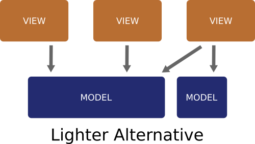

# Architecture

If you like architecture diagrams, then you'll love this page ;) discussions of **MVC**, **MVP** and **MVVM** can get quite abstract, and specific implementations often differ considerably. For the purposes of our discussion the following flow diagrams will do:

This is quite a common representation of **MVC**, however I don't think it's a particularly useful diagram - it depends entirely on the specifics of your controller which often isn't mentioned at all. If you are considering your activity to be the controller, then implementing something like this on Android is going to be a mess. If you are considering your controllers to be your click listeners then it's bascially a nothing diagram that shows a View interacting with a Model. (See below for a discussion of [Controllers](#whats-a-controller)).

There is one important thing to note about about this diagram however. If we focus on the **Model** [click here for our current definition of Model](https://erdo.github.io/asaf-project/02-models.html#shoom), all the arrows (dependencies) point towards the Model. This tells us that while the View and Controller know about each other and the Model, the Model knows nothing about the View or the Controller. That's exactly the way we want it. This way a Model can support any number of different Views which can come and go as they please (when an Android device is rotated for example) and the Model is not affected - or even aware of it.

I did say that I thought the typical MVC diagram is not particularly useful, I think it's main purpose is just to be shown before the MVP diagram is - so that we can see a particular difference. So here is a typical MVP diagram:

It's basically the same thing except here the View doesn't know about the Model. All interactions with the Model go via a Presenter class. The Presenter class does two things: it sets UI states on the View (so it needs to know about the View) and it forwards commands from click listeners and the like to the underlying Model / Models (so it needs to know about the Model too).

In a typical MVP Android app, a lot of boiler plate is required to let the Presenter do its job - and I think that's its main problem.

Note that as with MVC, the Model is not aware of the higher level View related classes - which is a good thing.

The main issue with both of these approaches on Android is the arrow pointing to the View

Android has a particular problem with this as the Views are destroyed and created even due to a simple screen rotation and each time that happens, all the references need to be recreated.

Here's the MVVM equivalent diagram:

Again there are different ways of doing MVVM, even on Android, but the main difference here is that the View-Model is not aware of the View like the Presenter is. All the arrows go from the edge of the system where the UI is, towards the center where things like business logic reside, down in the model layer.

In MVVM you typically have a View-Model for each View, so even though there are no dependencies on the View from the View-Model (no arrow pointing from View-Model to View), it's still a specific implementation for that View, you can't use one View-Model for different Views. A slightly more realistic situtation looks like this:

You can implement this using XML bindings on Android, but when you get into the details I don't think it's a particularly nice solution - especially the bit where you are moving code to XML, but it's a considerable step forward none the less. Importantly, all the arrows are pointing the right way!

Now finaly here is what ASAF looks like in a real app:

Well how does that work? you can't just remove boxes and call it better! (I hear you say). The devil is in the detail...

As with all the architectures discussed so far, here the Model knows nothing about the View. In ASAF, when the view is destroyed and recreated, the view re-attaches it self to the model using the observer pattern. Any commands are sent directly to the relevant model (no benefit in sending them via a Presenter).

**There are a few things in ASAF that allow you an architecture this simple:**

* The first is a very robust but simple Observer implementation that lets views attach themselves to any model they are interested in (more info on that [here](https://erdo.github.io/asaf-project/03-databinding.html#asaf-observables)).
* The second is the syncView() convention discussed [here](https://erdo.github.io/asaf-project/03-databinding.html#syncview). 
* The third is writing models at an appropriate level of abstraction, something which comes with a little practice, see [here](https://erdo.github.io/asaf-project/02-models.html#shoom) for more.
* The fourth is making appropriate use of DI, for more see [here](https://erdo.github.io/asaf-project/04-more.html#dependency-injection).

This can be summarised by the diagram below which actually manages to make things look more complicated than they are, don't worry, the actual code is a lot cleaner! (this diagram roughly matches what is going on in [sample app 1](https://erdo.github.io/asaf-project/#asaf-1-data-binding-example)). It'll probably make more sense to you once you have looked at the code.

> "Observable **Models**; **Views** doing the observing; and some **Data Binding** tricks to tie it all together"

 
### What's a Controller
It helps to remember that MVC is at least 3 decades old, I think it was Microsoft who invented it [I saw a Microsoft white paper written about it once, but I can't find it anywhere now]. A controller means different things on different platforms.

Originally a controller might have been a class that accepts mouse clicks at specific pixel co-ordinate, did some collision detection to find out which UI component was clicked, then sent that information on to the appropriate UI classes for further processing. (A controller in a web app however, might be a main entry point URL that forwards on requests to different parts of the system.)

In modern app frameworks most of the controller work is implemented for you by the UI framework itself - these are the button click listeners that simply catch user input and send it on to the right place. As we need to worry less about controllers now a days, we talk more about more "modern" things like MVVM - which is only about **10(!)** years old.

(Android also lets you use Activities as kind of "Controllers" by letting you specify callback methods right in the XML for buttons which will end up getting called on whatever activity is hosting that particular view. The idea is to not have to write click listeners - I'd recommend not using it because it encourages (forces) you to get the activity involved in something that it doesn't need to be involved in. If you leave everything out of the Activity then you can re-use your custom view in any activity you like, without needing to re-implement all those button call backs each time.)

