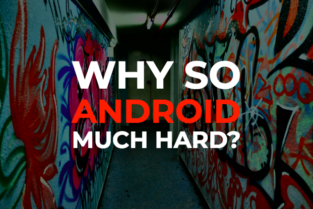
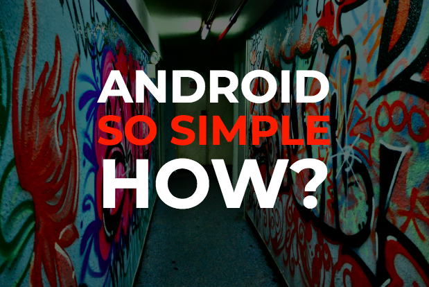

# Presentations

There are a couple of presentations hosted on surge that I occasionally use, they might be useful for you too. They don't really work on mobile though, (they are almost useable if you put your mobile browser in full screen mode and use left and right swipes to navigate).

They were written using [spectacle](https://github.com/FormidableLabs/spectacle) which is an awesome ReactJS presentation library.


### Android architecture basics



This spells out the main problem with the default android architecture and the motivation for using libraries like ASAF in the first place. I think many android developers don't realise this, even though with hindsight it kind of stares you in the face.

<strong>Presenter perspective including notes is [here](http://asaf-android.surge.sh/#/?presenter&timer)</strong>

<strong>Regular slides without notes is [here](http://asaf-android.surge.sh)</strong>

(if you open those two links on separate tabs of the same browser, the slides will automatically keep themselves in sync)


### ASAF basics



This one takes you though all the important points of ASAF together with a lot of examples. I don't think it really adds anything that isn't already in these docs - it's like a quick summary version.

<strong>Presenter perspective including notes is [here](http://asaf-asaf.surge.sh/#/?presenter&timer)</strong>

<strong>Regular slides without notes is [here](http://asaf-asaf.surge.sh)</strong>

(Again, if you open those two links on separate tabs of the same browser, the slides will automatically keep themselves in sync)


# Coding Exercise

In my day job I often take new developers through the basics of ASAF and I've found the most effective way of doing this (aside from pointing them in the direction of these docs) is to get them to do a basic two page android app. I give them as much time as they need as the focus should be on learning and understanding rather than producing code. They typically take between a few days and a week, although once they know what they are doing they could easily complete the whole thing in an hour or so.

What I find truly fascinating is that the feedback I give them once they have finished, tends to be around 75% identical. I could almost copy and paste my feedback from the last developer and just change the lines of code that I am referring to.

As the mistakes made are all so similar, I plan to add an equivalent exercise here together with the standard feedback, so that the reader can use it themselves, or with their team.

Stay tuned....


# Troubleshooting / How to Smash Code Reviews
Android apps that are written using ASAF have a certain *look* to them code-wise, the code in these docs and the sample apps looks very similar. This really helps when performing code reviews because structural errors tend to jump out at you a little more. The first part of this [**post**](https://www.joelonsoftware.com/2005/05/11/making-wrong-code-look-wrong/) explains the concept better than I could, and I'd recommend you give it a quick read.

## Typical characteristics of an app built with ASAF

- **The package structure** tends to contain two main packages (among others): **features** (which is usually straight forward testable code) and **ui** (which can only be tested with tools like Espresso or Robolectric). Examples: [here](https://github.com/erdo/asaf-full-app-example-kotlin/tree/master/app/src/main/java/co/early/asaf/fullapp01), [here](https://github.com/erdo/password123/tree/master/app/src/main/java/co/early/password123) and [here](https://github.com/erdo/asaf-project/tree/master/example04retrofit/src/main/java/foo/bar/example/asafretrofit)
- **Activity and Fragment classes tend to be very light** and won't contain a lot of code in them. They are part of the [view layer](https://erdo.github.io/asaf-project/01-views.html#shoom) after all. Examples: [here](https://github.com/erdo/password123/blob/master/app/src/main/java/co/early/password123/ui/passwordchooser/PwChooserFragment.kt), [here](https://github.com/erdo/asaf-project/blob/master/example04retrofit/src/main/java/foo/bar/example/asafretrofit/ui/fruit/FruitFragment.java) and [here](https://github.com/erdo/password123/blob/master/app/src/main/java/co/early/password123/ui/passwordchooser/PwChooserActivity.kt)
- **The View classes follow a very standard flow** which is: get a reference to UI components -> inject model dependencies -> setup click listeners/adapters etc -> setup any animations if needed -> implement databinding by adding and removing an observer and using a syncView method. Examples: [here](https://github.com/erdo/asaf-project/blob/master/example03adapters/src/main/java/foo/bar/example/asafadapters/ui/playlist/PlaylistsView.java), [here](https://github.com/erdo/password123/blob/master/app/src/main/java/co/early/password123/ui/passwordchooser/PwChooserView.kt) and [here](https://github.com/erdo/asaf-full-app-example-kotlin/blob/master/app/src/main/java/co/early/asaf/fullapp01/ui/fruitcollector/FruitCollectorView.kt)

Given any app that is attempting to implement ASAF: first check the package structure, then investigate one of the activities and/or fragments to check it's as small as it can be. Next take a look at a View class to see if you recognise the flow mentioned above. Check the databinding especially i.e. is an observer being added and removed, how does the syncView method look. Look out for any ui state being set outside of the syncView method. It should take seconds to establish if the project is approximately correct and has a chance of the UI remaining consistent, handling rotations and not having memory leaks. Further to that here is a list of specific warning signs that will highlight potentially incorrect code (this list is especially helpful for code reviews - these are all things I have seen from developers who have just been introduced to this library).


<a name="adhoc-state-setting"></a> 1) **Any code setting or updating view states that is not inside the syncView() method**. Example: "clickListener -> setDisabled". That's usually an indication that the developer might not understand why syncView() is designed like it is, and will almost certainly result in hard to identify UI consistency bugs when screens are rotated etc. Point them to the data binding section where it talks about [syncView()](/asaf-project/03-databinding.html#syncview).

<a name="fat-activity"></a> 2) **Activities and Fragments that have more than a few lines of code in them**. Sometimes there are good reasons for putting code in Activities and Fragments, setting up bundles and intents for example, but you should be immediately suspicious of any errant code that gets into these classes. Often this code can be moved to a model class, safely away from tricky lifecycle issues and where it can also be more easily tested. (If you value your sanity and that of your team, you should make sure that there are absolutely **no** AsyncTask instances or networking code in any Activity or Fragment classes at all. Ever.)

<a name="activity-casting"></a> 3) **Code in a Fragment that casts it's parent activity and then calls that activity for further processing**. Again sometimes that is appropriate, but unfortunately it's a very common pattern that is often misused. The idea of course is to let a Fragment communicate with an Activity in a safe way. When this technique is used as a way to access functionality written in the parent activity which should really have been written in a model class in the first place, it just acts as a sticking plaster for a problem that should never have existed in the first place. The answer of course is to put that code in a model, inject that model into the fragment and let the fragment access it directly, that totally removes the dependence on the host Activity and removes a lot of boiler plate in the process.

<a name="non-lifecycle-observers"></a> 4) **Adding or removing observers outside of android lifecycle methods**. I'm not saying there is never a good reason to do that (particularly if you want to set up one long living model to observe the state of another long living model). But it is a bit unusual and might warrant a rethink. It's usually a mistake (and a cause of memory leaks).

<a name="add-remove"></a> 5) Wherever you see an **addObserver()** it's always worth checking that you can see the associated **removeObserver()** call to make sure references are being cleaned up and memory isn't being leaked.

<a name="missing-notifyobservers"></a> 6) **Any change of state (usually a setter method) in an observable model that doesn't end with a call to notifyObservers()**. Even if it's not necessary for the current implementation, by not notifying the observers here, we now have a model that only works in certain (undocumented) circumstances. If someone else comes along and wants to observe your model and does not get a notification as expected when some state changes, something will break.

<a name="slow-getters"></a> 7) **Any getter method that does more than pass back an in-memory copy of the data asked for**. In order for the databinding to be performant, we want any getter methods to return fairly quickly. Try to front load any processing in the setters rather than the getters.

<a name="complicated-observers"></a> 8) **Any observers that do anything other than sync their entire view** are usually (but not always) incorrect. Generally the observer just does one thing (sync the view), and this means you can use the same instance of that observer to register with several different models in the same view (it's another reason for not doing what's discussed in FAQ 1).

<a name="notification-counting"></a> 9) **Code or tests that makes assumptions about the number of times syncView() or somethingChanged() will be called** This is pretty important, you can't fire one off events based on syncView() being called (like starting an activity for example), because you are depending on being notified by the model an exact number of times. The deal is that whenever something (anything) changes in the model, you will be notified. But you maybe be notified more than you expect, especially if the model is refactored at a later date to add new features or in some way the internal implementation of the model changes. In order to be robust, your syncView must make no assumptions about the number of times it may or may not be called. If this is causing you problems, check [this](https://erdo.github.io/asaf-project/06-faq.html#observer-listener) and the [SyncTrigger](https://erdo.github.io/asaf-project/04-more.html#synctrigger) for some potential solutions.

<a name="complicated-syncview"></a> 10) **A syncView() that is more than 5-10 lines long and/or doesn't have one line to set an affirmative value for each property of each UI element you are concerned with**. Take a look at how to write a good [syncView()](https://erdo.github.io/asaf-project/03-databinding.html#syncview) method under the data binding section.

<a name="redundant-click-routing"></a> 11) **Any click listeners or text change listeners should generally be talking directly to model classes, or asking for navigation operations** for example: MyActivity.startMe(getContext()). Occasionally it's useful for listeners to directly call syncView() to refresh the view (when an edit text field has changed for example). What they generally shouldn't be doing is accessing other view components like fragments or activities and checking their state in some way, if you follow this code it generally ends up calling a model class somewhere down the line, in which case the model class should just be called directly (you get your model references to any view class using [dependency injection](/04-more.html#dependency-injection)).

<a name="state-callbacks"></a> 12) **Public methods on models that return their state directly through a callback, and therefore short cut the Observable pattern**. More on that here: [When should I use an Observer, when should I use a callback listener?](/asaf-project/06-faq.html#observer-listener)

<a name="view-state"></a> 13) **Any state kept in view layer classes is at risk of being lost**. How does this view survive rotation, would loosing that state matter? if yes, then it might be better kept inside a model, away from the view layer.

<a name="view-logic"></a> 14) **Any logic kept in view layer classes is usually harder to test**. It can be hard to totally remove all the logic from the view layer (especially navigational logic once you factor in the back button) but be aware that the logic here is usually a lot harder to test and if you can move it away from the view layer reasonably easily, then you probably should. If there is some particularly complicated logic for a view state in the syncView() method for example, that logic is a prime candidate to be moved out of the view layer into a model/util class where it can more easily be tested and simply called from the syncView() method.

<a name="syncview-name"></a> 15) **Having a syncView() method, but not calling it syncView()**. I'm not sure why people do that (it's probably just annoying to be told what to call your method). But this specific method is talked about a lot and it's very handy to call it the same thing so that everyone knows what everyone else is talking about. Making your View implement [SyncableView](https://github.com/erdo/asaf-project/blob/master/asaf-core/src/main/java/co/early/asaf/core/ui/SyncableView.java) is probably a good idea anyway.


# Dependency Injection Basics

Dependency Injection is pretty important, without it I'm not sure how you could write a properly tested Android app. But it's not actually that complicated.

All it really means is instead of instantiating the things that you need to use (dependencies) inside of the class that you're currently in, pass them **to** your class instead (either via the constructor or some other method if the constructor is not available such as with the Android UI classes).


Don't do this:

```
public MessageSender() {
    networkAccess = new NetworkAccess();
}
```

Do this instead

```
public MessageSender(NetworkAccess networkAccess) {
    this.networkAccess = networkAccess;
}
```

If you don't have access to the constructor, you can do this (like we do in a lot of the ASAF sample apps):

```
MessageSender messageSender;

protected void onFinishInflate() {
    super.onFinishInflate();

    messageSender = CustomApp.get(MessageSender);
}
```

In a commercial app, the number of dependencies you need to keep track of can sometimes get pretty large, so some people use a library like Dagger2 to manage this:

```
@Inject MessageSender messageSender;

protected void onFinishInflate() {
    super.onFinishInflate();

    DaggerComponent.inject(this);
}
```

The main reason for all of this is that dependency injection enables you to swap out that NetworkAccess dependency (or swap out MessageSender) in different situations.

Maybe you want to swap in a mock NetworkAccess for a test so that it doesn't actually connect to the network when you run the test. If NetworkAccess is an interface, dependency injection would let you replace the entire implementation with another one without having to alter the rest of your code.

A quick way to check how your Java code is doing on this front is to look for the keyword ***new*** (it's slightly less obvious in Kotlin as there is no *new* keyword). If you are instantiating an object, then that is a dependency that won't be able to be swapped or mocked out at a later date (which may be fine, as long as you are aware of it).

*Incidentally don't let anyone tell you that you must use a dependency injection framework in your android app. In the ASAF sample apps, all the dependencies are managed in the ObjectGraph class and managing even 100 dependencies in there is no big deal (and if you have an app with more than 100 global scope dependencies then you're probably doing something wrong) Anyway, if you and your team dig dagger, then use it. But if you spent a few days stabbing yourself in the eye with it instead - feel free to manage those dependencies yourself. See [here](http://blog.ploeh.dk/2014/06/10/pure-di/) for more on this*


### Inversion of Control

This term really confused me when I first heard it years ago, so here's my take in case it's helpful for you.

Imagine if we have a company. It has a CEO at the top. Underneath the CEO are departments like Marketing, HR, Finance. Those departments all print documents using a printer.

The CEO is in control of the whole lot, whatever she says goes. But if you took that to extremes it would be ridiculous. The CEO would tell the departments exactly what documents to print, but also with what paper, and what printer ink. When paper tray 3 ran out, the CEO would be the one to decide to switch to using paper tray 2 instead, or to display an error on the printer display. After 5 minutes of no printing, the CEO would decide to put the printer into power saving mode. You get the idea. Don't write software like that.

Inversion of control means turning that control on its head and giving it to the lower parts of the system. Who decides when to enter power saving mode on the printer? the printer does, it has control. And the printer wasn't manufactured in the office, it was made elsewhere and "injected" into the office by being delivered. Sometimes it gets swapped out for a newer model that prints more reliably. Write software like that.


### Global vs Local scope dependencies and rotation

Most of the models used in ASAF (the dependencies in this case) tend to be global in scope i.e. they exist throughout the lifetime of the app. A good example would be an **AccountModel** with methods such as **login(), logout(), isLoggedIn(), isCurrentlyPerformingNetworkAccess(), getUserName()** etc. This means they will maintain any state they have (such as whether they are currently performing network access or not) independent of anything that is happening in the view layer.

This of course means that when a view is rotated, it makes no difference to the model.

**[We're not talking about data pojos here btw, if your view is just being driven by some data that has a fixed state, you can use techniques like fragments.setArguments(bundle), and rotation will work just fine.]**

For models whose state sometimes changes and are observable, once a rotation is complete and a new activity & view created by Android, ASAF databinding ensures that this new view is synced with the latest state of the model (if the model is still performing network access, the view will show a swirly, for example). The re-hooked up observers take care of any changes from there on in.

However we still have a problem with locally scoped models: for locally scoped models (regardless if you are using Pure DI or Dagger) the actual scope of the model is usually tied to a class in the UI layer (Activity class, or your custom View class). On rotation, these View layer classes disappear and the locally scoped model reference (and the state it holds) disappears with it.

The solution is to extend the lifecycle of these models so that they survive beyond rotation, you can do that using something like Google's ViewModel, or use a home grown solution, for example storing a reference to them statically, or anywhere tied to the application lifecycle. *(If you are using Dagger2, it is your locally scoped Component class that you need to keep a reference to)*


# ~~Frequently~~ Occasionally Asked Questions

## <a name="somethingchanged-parameter"></a> 1) Why not put a parameter in the Observer.somethingChanged() method?

If I had a dollar for everyone who asked me this question! (I would have, about $4)

There is a very good reason why we don't have a parameter here, but it is complicated, so stay with me. We could use a generic maybe and let a model send data or a message directly to the observers. Sending data like that might at first seem like an easy and convenient thing to do, but in my experience it basically always ends up in a world of maintenance pain.

Adding a parameter here would let client code use the observer like some kind of messenger thing or an event bus. While that could be a perfectly valid thing to do for the specific situation you find yourself in, when it comes to binding data to an android view layer it almost always ends up destroying the long term maintainability of the code base.

(Adding a parameter here has been tried by yours truly in many different projects over the years by the way, it always ends up being removed resulting in a considerably cleaner code base, so this has been the approach now for a number of years and it seems to work very well).

One reason (but not the only one) is that often, different views or other Observers will want different things from the same model and as the code evolves, that model slowly ends up having to support many different flavoured observables all with different parameter requirements.

Similarly there will often be views or other Observables that are interested in more than one model, and if those models all have different observable interfaces, all those interfaces will need to be implemented and managed by the view, rather than just using a single Observer implementation.

It just balloons the amount of code that needs to be written. It also leads developers down the wrong path regarding data binding and ensuring consistency when your application is rotated etc (see more on that in the [data binding](/asaf-project/03-databinding.html#shoom) section).

[Quick example, [this view](https://github.com/erdo/asaf-project/blob/master/example02threading/src/main/java/foo/bar/example/asafthreading/ui/CounterView.java) is driven by [these](https://github.com/erdo/asaf-project/blob/master/example02threading/src/main/java/foo/bar/example/asafthreading/feature/counter/CounterWithLambdas.java) [two](https://github.com/erdo/asaf-project/blob/master/example02threading/src/main/java/foo/bar/example/asafthreading/feature/counter/CounterWithProgress.java) models. If each model had a different parameter in its somethingChanged() method, the view would need to implement two different observer callbacks - now what if the view was interested in 5 different models? (which would not be a problem at all for ASAF by the way): The view would need to implement and manage a whole bunch of different observers, or you would need a super model that wrapped all that and presented one observable interface to the view, i.e. extra code, extra tests, no benefit]

Passing a parameter here is also the "obvious" thing to do - which means, if it's an option, it will always be chosen by the less experienced developers in the team. Apart from giving you code review headaches, letting a new developer do that would prevent that developer from learning the more powerful way to use this framework - which, although extremely simple, can take a while to get your head around.

This is one case where ASAF is stopping you from making an easy but horrible architectural mistake. The library is as valuable for what you can't do with it, as it is for what you can do with it.


> "This library is as valuable for what you **can't** do with it, as it is for what you **can** do with it."


Try to get comfortable using these observers to just notify observing client code of any (unspecified) changes to the model's state (once the observing client code has been told there are changes, it can use fast returning getters on the model to find out what actually happened, redraw it's state, or whatever - if this isn't straight forward then the models you have implemented probably need to be refactored slightly, check the [observer vs callback](/#observer-listener) discussion first). For some, this is a strange way to develop, but once you've done it a few times and you understand it, the resulting code is rock solid and very compact.

If you want a library that lets you send data in these observables, you should look at RxJava and LiveData. Both libraries are an implementation of the Observer pattern and let you subscribe to notifications from data sources. RxJava is of course much larger and is focussed on data streams. It's great for processing data from IoT devices, processing video streams etc, but for data binding it's not suitable IMHO (mainly because of it's huge and flexible API, none of which you will need to crack robust databinding, indeed a surprising number of RxJava tutorials have databinding implementations which are broken for device rotation, even the ones that are specifically demonstrating databinding!)


## <a name="observer-listener"></a> 2) When should I use an Observer, when should I use a callback listener?

The observer pattern is not always going to be suitable for what you want to do. In particular, if you are looking to receive a one off success/fail result from a model as a direct result of the model performing some operation (like a network request) then a regular callback will probably serve you better. In this case the success or failure of the network call does not alter any fundamental state of the model, so a callback / listener is ideal.

for example:

```
model.doStuffOnAThread(new ResultListener{
    @Override
    public void success(){
        //do next thing
    }
    @Override
    public void fail(UserMessage reason){
        showMessage(reason);
    }
});
```


You can use both patterns in the same model with no problem of course, in the example above the model could have a busy state that changes from false to true and back to false again during a network request so that view code can redraw itself as showing a busy swirly if appropriate. That would be better managed using an observer pattern as follows:

```
public void doStuffOnAThread(final ResultListener resultListener){

    busy = true;
    notifyObservers();

    startAsyncOperation(new FinishedListener(){
        @Override
        public void finished(){
            busy = false;
            resultListener.success();
            notifyObservers();
        }
    });
}
```


For a real example of both techniques, take a look at the **FruitFetcher.fetchFruits()** method in the [retrofit example app](https://github.com/erdo/asaf-project/blob/master/example04retrofit/src/main/java/foo/bar/example/asafretrofit/feature/fruit/FruitFetcher.java). Notice how it fetches some fruit definitions, which does change the state of the model and therefore results in a call to the notifyObservers(). But the success or failure of the result is temporary and does not form part of the state of the FruitFetcher model, so that is just reported via a call back and the model forgets about it.

For consistency, and for the same reasons outlined [above](#somethingchanged-parameter), try to strongly resist the urge to respond directly with the data that was fetched via this listener. i.e. callback.success(latestFruit). It's tempting, and it will even work, but it breaks the whole point of the Observer pattern and it leads any inexperienced developers who are trying to use your model for their own view down the wrong path - why would they bother to implement the observer pattern and syncView() properly in their view if they can just take a short cut here (hint: they won't). And then you will loose all the benefits of databinding, see [syncView()](/asaf-project/03-databinding.html#syncview) for a refresher.


## <a name="syncview"></a> 3) Syncing the whole view feels wasteful, I'm just going to update the UI components that have changed for efficiency reasons.

This seems to be the reaction of about 20% of the developers that come across this pattern for the first time. I think it might depend on what style of development experience they have have had in the past.

The first thing to bare in mind is of course: "premature optimisation is the route of all evil" or however that quote goes.

The second thing is to make absolutely sure there is a complete understanding of the section on [syncView()](/asaf-project/03-databinding.html#syncview), particularly the example of how doing ad-hoc updates can go wrong.

Everything in computing is a trade off, and when considering a trade off you need to understand two things: **the upsides** (in this case: being "efficient" and only updating the parts of the view that need updating) and **the downsides** (in this case: loosing the ability to support rotations by default, and increasing the risk of UI consistency issues as discussed in the syncView() link above).

Making a tradeoff when you don't fully appreciate one of those sides (up or down) is obviously not a great place to be.

If after appreciating the downsides of this tradeoff, there is still an interest in sacrificing that robustness in the name of "performance" or "battery life", then read on.

This is not usually a problem for any developer that has written game loops, or implemented their own animations using easing equations or similar, but if you've never done that type of development, you might be in danger of seriously underestimating how fast even the most basic android phone runs.

### In to the matrix

Before we go any further, if you haven't already, go to developer settings on android and check out the debug tools that let you see the screen updates as they happen.

***WARNING if you're epileptic, maybe skip this part, you will see some incredibly annoying rapid screen flashing as the screen is updated multiple times a second. I'm not epileptic but a few minutes of that makes me feel seriously car sick.***

The first one is **"Show surface updates"** it flashes when part of the screen is being redrawn. You might be surprised just how often the screen is being updated as you use your android device.

The second option you have is **"Show GPU view updates"** this only shows GPU updates and depending on your device you may see this working a lot, or not at all.

Now that you've peeked a little under the hood, you'll be able to appreciate that if you're looking at a single waiting animation (like a standard indeterminate progress bar on Android), the screen (or at least that part of it) will be updating the UI around 30 times a second in response to a ui widget that is continually recalculating its state, also 30 times a second. Any scrolling of a list view; any background blurring animation; even a blinking cursor will sometimes cause the screen to be redrawn 30 times a second or so. That's how fast it needs to be to trick human eyes into thinking something is moving when it isn't - you're just seeing a sequence of still images.

If you put some logs in the syncView() method you'll also see that it is in fact hardly called at all most of the time, unless you are using the Observables to run an animation loop (which is something that you absolutely can do given the performance of the observer implementation in this library by the way).

The syncView() also completes pretty quickly as all of your getters should be returning fast anyway, as recommended [here](/asaf-project/02-models.html#model-checklist).

In addition, if you are setting a value on a UI element that is the same as the value it already has, it would be a bug in the android framework if it caused a complete re-layout in response anyway (I'm not saying such bugs don't exist, but if you ever get any kind of performance issues with this technique, that's the time to measure and see what is happening, but if you follow the guidelines here correctly you will almost certainly  never have any problems at all even on low end devices, and what you get in return is unparalleled robustness).

If you have a model that is changing in some way that an observer just so happens NOT be interested in, you will end up making a pass through syncView() unecessarily (but still not actually redrawing the screen): chillax and be happy with the knowledge that your UI is *definitely* consistent ;)
