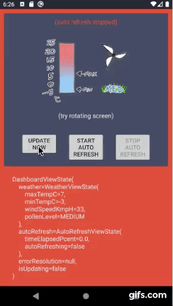

# android fore

[](https://github.com/erdo/android-fore/blob/master/LICENSE.txt){: .float-left}

{: .float-left}

{: .float-left}

[](https://circleci.com/gh/erdo/android-fore/tree/master){: .float-left}

<br/>
<br/>

**fore** helps you move code out of the view layer, leaving your reactive view code to deal with the absolute fundamentals: *what things look like*

## Quick Start

```
implementation("co.early.fore:fore-kt-android:1.5.19")
```

More detailed [version / package information here](https://erdo.github.io/android-fore/06-upgrading.html#shoom).

### Compose

For Compose, use fore's observeAsState() function [example](https://dev.to/erdo/tic-tac-toe-from-mvp-to-jetpack-compose-57d8)
```
implementation("co.early.fore:fore-kt-android-compose:1.4.0-alpha02")
```

## Current status

For the 5 plus years that fore has been published on <strike>jcenter</strike> & mavenCentral, the core code has proven pretty stable and has remained almost identical apart from the addition of kotlin / coroutines under the hood several years ago.

fore still supports Java, and an extremely performant Android app with a reactive UI, running on a 4.1 device from 10 years ago is still completely doable (and with an apk measured in kB rather than MB). But the Kotlin non-core packages like **fore-kt-network** is where most of the development happens nowadays

**fore v2.0** will have no major API changes. To prepare for it just make sure to update any older deprecated functions with their replacements - the deprecated code will finally get removed in 2.0 (this applies mainly to the non-core packages)

## New to fore

**fore** is a small library, plus a selection of techniques. Its main job is to reactively tie together architectural layers in the safest, most de-coupled and low boiler plate way possible.

It doesn't dictate any particular architecture (presentation layers observing changes that originate in other layers is a requirement of many different reactive architectures).

For instance in a clean architecture app, you could create a reactive UI which uses fore observers to update itself based on changes that originate in the domain layer.


The quickest integration (from an Activity say) - observe your model(s):

```
override fun onCreate(savedInstanceState: Bundle?) {
    super.onCreate(savedInstanceState)

    //setup observers
    lifecycle.addObserver(LifecycleObserver(this, viewModel))

    ....
}
```

and then implement the syncView() function

```
//called on the UI thread, whenever the viewModel state changes
override fun syncView() {
    viewModel.viewState.apply {
        dashboard_busy.showOrInvisible(isLoading)
        dashboard_updatenow_btn.isEnabled = !isLoading
        dashboard_pollenlevel_img.setImageResource(pollenLevel.toImgRes())
        ...
    }
}
```
Full examples: [here](https://github.com/erdo/persista/blob/main/example-app/src/main/java/foo/bar/example/ui/wallet/WalletsActivity.kt) and [here](https://github.com/erdo/clean-modules-sample/blob/main/app/ui/src/main/java/foo/bar/clean/ui/dashboard/DashboardActivity.kt)

## Overview

Imagine your app existing entirely separately from its UI (its UI could be a command line interface, or a GUI, compose or otherwise - the app shouldn't care or even know what type of UI it has). Then imagine the UI layer as a thin window on to this app, free to deal exclusively with _what things look like_.

This level of separation is a goal of lots of architectures and it's a great way to develop anything that has a UI. It's especially helpful for a platform like android with its ephemeral view layer that gets destroyed and recreated on rotation. It also lets you junit test almost everything, the UI layer becoming as close to trivial as possible.

### Observers and Observables

This is the kind of challenge that the observer pattern (see the GoF book for more info) has been solving for decades. And the main innovation in fore is its radically simplified observer implementation. It lets you decouple architectural layers to a degree that would not normally be possible.

At this point, you might be thinking that fore is a reactive streams implementation like Rx or Kotlin Flow. In fact (other than the observer pattern) fore and reactive streams have very little to do with each other, and it's perfectly possible to find them both in the same project.

While connecting architectural layers with reactive streams is often done, it usually (always?) results in more boiler plate when compared with a fore style solution. Plus this additional code (when it appears in a view layer) needs to be aware of lifecycle and threading issues which are only present in view layers. This boilerplate difference becomes steadily more apparent as app complexity increases (this explains [why](https://erdo.github.io/android-fore/07-fore-api.html#somethingchanged-parameter)).

On the other hand, asynchronously processing real time data io with back pressure handling would be a natural fit for something like Rx or Flow (that is basically what [reactive streams](http://www.reactive-streams.org/) lives for). Trying to do that with a fore observable would be pointless.

**fore**'s observable classes basically let you **make anything observable** from the perspective of the UI thread (usually it's repositories or classes in the domain layer that are made **observable**, and things in the view layer like activities, fragments or custom views do the **observing**). Here's how you make an AccountRepository class observable for example (no need to use a Repository for this, it works with any class):

These code samples will make more sense in the web docs, so [(click here)](https://erdo.github.io/android-fore/#observers-and-observables) if you're reading this on github

<!-- Tabbed code sample -->
 <div class="tab">
   <button class="tablinks java" onclick="openLanguage('java')">Java</button>
   <button class="tablinks kotlin" onclick="openLanguage('kotlin')">Kotlin</button>
 </div>

<pre class="tabcontent tabbed java"><code>
public class AccountRepository extends ObservableImp {

  public AccountRepository(WorkMode workMode) {
    super(workMode);
  }

  ...

}
 </code></pre>

<pre class="tabcontent tabbed kotlin"><code>
class AccountRepository
: Observable by ObservableImp() {

  ...

}
 </code></pre>


 Somewhere in the view layer (Activity/Fragment/View or ViewModel) there will be a piece of code like this:


 <!-- Tabbed code sample -->
  <div class="tab">
    <button class="tablinks java" onclick="openLanguage('java')">Java</button>
    <button class="tablinks kotlin" onclick="openLanguage('kotlin')">Kotlin</button>
  </div>

<pre class="tabcontent tabbed java"><code>
Observer observer = this::syncView;
</code></pre>

<pre class="tabcontent tabbed kotlin"><code>
val observer = Observer { syncView() }
</code></pre>


And that observer is typically added and removed from the observable in line with lifecycle methods so that we dont get any memory leaks. In the case below, a fragment is observing a Wallet [model](https://en.wikipedia.org/wiki/Domain_model) representing the details of a user's wallet.

<!-- Tabbed code sample -->
 <div class="tab">
   <button class="tablinks java" onclick="openLanguage('java')">Java</button>
   <button class="tablinks kotlin" onclick="openLanguage('kotlin')">Kotlin</button>
 </div>

<pre class="tabcontent tabbed java"><code>
@Override
protected void onStart() {
    super.onStart();
    wallet.addObserver(observer);
    syncView(); //  <- don't forget this
}

@Override
protected void onStop() {
    super.onStop();
    wallet.removeObserver(observer);
}
 </code></pre>

<pre class="tabcontent tabbed kotlin"><code>
override fun onStart() {
    super.onStart()
    wallet.addObserver(observer)
    syncView() //  <- don't forget this
}

override fun onStop() {
    super.onStop()
    wallet.removeObserver(observer)
}
 </code></pre>

That's what a line like:

```
//setup observers
lifecycle.addObserver(LifecycleObserver(this, wallet))
    
```
does for you automatically. It takes a **vararg**, so you're not limited in the number of observable models you can observe, for example this is also fine:

```
//setup observers
lifecycle.addObserver(LifecycleObserver(this, wallet, inbox, account))
    
```

All that's left to do now is to implement **syncView()** which will be called on the UI thread whenever the state of your observables change. You'll probably notice that syncView() shares some characteristics with MVI's render() or MvRx's invalidate(), though you might be surprised to learn that fore has been using syncView() to implement unidirectional data flow since at least 2013!

<!-- Tabbed code sample -->
 <div class="tab">
   <button class="tablinks java" onclick="openLanguage('java')">Java</button>
   <button class="tablinks kotlin" onclick="openLanguage('kotlin')">Kotlin</button>
 </div>

<pre class="tabcontent tabbed java"><code>
public void syncView(){
    increaseMobileWalletBtn.setEnabled(wallet.canIncrease());
    decreaseMobileWalletBtn.setEnabled(wallet.canDecrease());
    mobileWalletAmount.setText("" + wallet.getMobileWalletAmount());
    savingsWalletAmount.setText("" + wallet.getSavingsWalletAmount());
}
 </code></pre>

<pre class="tabcontent tabbed kotlin"><code>
override fun syncView() {
    wallet_increase_btn.isEnabled = wallet.canIncrease()
    wallet_decrease_btn.isEnabled = wallet.canDecrease()
    wallet_mobileamount_txt.text = wallet.mobileWalletAmount.toString()
    wallet_savingsamount_txt.text = wallet.savingsWalletAmount.toString()
    wallet_balancewarning_img.showOrGone(wallet.mobileWalletAmount<2)
}

</code></pre>

In this example the wallet state is being exposed via individual getters / properties, but the state could just as well be exposed via a single immutable state (like in the clean architecture sample linked to below) it's entirely up to you, it makes no difference to the syncView() technique.

Making the most of fore's ability to remove boiler plate, a fully reactive, fully testable, memory leak free, rotatable view layer can easily come in under 100 lines of code:

<pre class="codesample"><code>
class DashboardActivity : FragmentActivity(R.layout.activity_dashboard), SyncableView {

    //models that we need to sync with
    private val viewModel: DashboardViewModel by viewModel()

    override fun onCreate(savedInstanceState: Bundle?) {
        super.onCreate(savedInstanceState)

        //setup observers
        lifecycle.addObserver(LifecycleObserver(this, viewModel))

        //setup click listeners
        dashboard_startautorefresh_btn.setOnClickListener { viewModel.startAutoRefresh() }
        dashboard_stopautorefresh_btn.setOnClickListener { viewModel.stopAutoRefresh() }
        dashboard_updatenow_btn.setOnClickListener { viewModel.updateNow() }
    }

    //called on the UI thread, whenever the viewModel state changes
    override fun syncView() {
        viewModel.viewState.apply {
            dashboard_busy.showOrInvisible(isUpdating)
            dashboard_updatenow_btn.isEnabled = !isUpdating
            dashboard_startautorefresh_btn.isEnabled = !autoRefresh.autoRefreshing
            dashboard_stopautorefresh_btn.isEnabled = autoRefresh.autoRefreshing
            dashboard_pollenlevel_img.setImageResource(weather.pollenLevel.toImgRes())
            dashboard_tempmaxmin.setMaxPercent(weather.maxTempPercent())
            dashboard_tempmaxmin.setMinPercent(weather.minTempPercent())
        }
    }
}

</code></pre>

That's the essential code which runs this UI



The [full code](https://github.com/erdo/clean-modules-sample/blob/main/app/ui/src/main/java/foo/bar/clean/ui/dashboard/DashboardActivity.kt) with animations is not much bigger

Writing view layers this way helps quite a bit from a complexity standpoint, and it's one of the things that makes fore suitable for both quick prototypes, and large complex commercial projects with 100K+ lines of code. Specifically _why_ it is that apps written this way are both sparse _and_ scalable is not always immediately obvious though. This [discussion](https://erdo.github.io/android-fore/07-fore-api.html#somethingchanged-parameter) gets into the design of the fore api and why it drastically reduces boiler plate for a typical android app compared with alternatives. Some of the dev.to tutorials (see below) also touch on the complexity / robustness aspect.

Here's a very basic example from one of the mini kotlin apps included in the fore repo: [View](https://github.com/erdo/android-fore/blob/master/app-examples/example-kt-01reactiveui/src/main/java/foo/bar/example/forereactiveuikt/ui/wallet/WalletsActivity.kt) and [Model](https://github.com/erdo/android-fore/blob/master/app-examples/example-kt-01reactiveui/src/main/java/foo/bar/example/forereactiveuikt/feature/wallet/Wallet.kt) code, and the tests: a [Unit Test](https://github.com/erdo/android-fore/blob/master/app-examples/example-kt-01reactiveui/src/test/java/foo/bar/example/forereactiveuikt/feature/wallet/WalletTest.kt) for the Model, and an [Espresso Test](https://github.com/erdo/android-fore/blob/master/app-examples/example-kt-01reactiveui/src/androidTest/java/foo/bar/example/forereactiveuikt/ui/wallet/WalletsActivityTest.kt) for the View

Read more about the [MVO](https://erdo.github.io/android-fore/00-architecture.html#shoom) architecture of fore apps.

### Motivation

There is often a tendency in business requirements towards complexity, the longer a project exists, the more complex it becomes. For an android app to remain maintainable over a period of years, it needs to be able to absorb this complexity without too much damage to the code base. So if there was one guiding principle followed when developing fore and its techniques, it was probably: *complexity is the enemy*.

Simple != Easy but fore aims to get you and your team to Simple (and performant) as quickly as possible so you can spend more time writing features and less time fixing bugs.

[gmk57](https://gmk57.medium.com/) on medium forwarded me a great [comment](https://medium.com/@a.artikov/i-in-my-opinion-this-solution-is-over-complicated-77ce684a4014) which I think applies here: **_In quantum physics there is an effect where observing of a system changes properties of this system_**. That complication is something we are explicity avoiding with fore (the things being observed with fore don't know or even care what is observing them). If you do want to link your UI state to some app behaviour though, that's as easy as: ```onResume(){gpsTracker.start()}``` for example. It doesn't require you to manage any streams of data in order to do that (the fore observers will continue to ensure that the UI reflects the current app state regardless).

Anyway, because of the low boiler plate and the clear separation of architectural layers you get when developing this way, reactivity implemented with fore can help you with issues like **code complexity**; **testability**; **UI consistency**; **memory leaks**; and **development speed** - and if you're spending time dealing with any of those issues in your code base or team, it's well worth considering!

## Where to get more information

This repo includes the tiny fore library, the optional packages, and 12 mini example apps. Any updates to fore are immediately reflected in the example apps and all their tests need to pass before new versions of fore are released, so they tend to remain current and are a good place to start if you're trying to figure out how things fit together:

`git clone git@github.com:erdo/android-fore.git`

There are also a few tutorials on dev.to [like this one](https://dev.to/erdo/tutorial-spot-the-deliberate-bug-165k) which demonstrates how the syncView() convention helps you to write less code, while removing a whole class of UI consistency bugs from the UI layer. Or [this one](https://dev.to/erdo/tutorial-android-architecture-blueprints-full-todo-app-mvo-edition-259o) which details the whys and the hows of converting the Android Architecture Blueprint Todo sample app from MVP to [MVO](https://erdo.github.io/android-fore/00-architecture.html#shoom) using fore.

Most of the sample apps take a minimalist approach to architecture (though they do maintain a very clear separation between the UI layer and the rest of the app) but fore doesn't dictate the architecture, it's simply a tool to have architectural layers observe other layers, safely, and with the least amount of boiler plate possible. For example, this sample app uses fore to implement a [clean architecture module](https://github.com/erdo/clean-modules-sample) structure (which now also comes with its own [article](https://dev.to/erdo/clean-architecture-minus-reactive-streams-10i3)). Another example with slightly more architecture is the [Apollo3](https://dev.to/erdo/android-apollo3-and-graphql-1e8m) article and sample app on dev.to

The most recent fore sample comes from the [fore and Compose article](https://dev.to/erdo/tic-tac-toe-from-mvp-to-jetpack-compose-57d8) on dev.to which covers the basics of migrating a tick-tac-toe app from MVP to Compose.

If you have a question about the best way to achieve what you want with fore, consider opening an issue (even better, a stackoverflow question which you can link to from an issue). Also, if you want to write an article related to fore, if you open an issue about it, we might include a link to it from the docs

## Sample Apps


The mini example apps included with the repo are deliberately sparse and ugly so that you can see exactly what they are doing. These are not examples for how to nicely structure XML layouts - all that you can do later in the **View** layers whether in traditional XML, or Jetpack Compose, and it should have no impact on the stability of the app. Process death in the sample apps just wipes all the data, if you're looking for ways to handle that without cluttering up the view layer, the clean architecture sample app linked to above uses [persista](https://github.com/erdo/persista) to save/recover the state of the app across process death. 

These apps are however, totally robust and comprehensively tested (and properly support rotation). And that's really where you should try to get to as quickly as possible, so that you can **then** start doing the fun stuff like adding beautiful graphics and cute animations.

For these example apps, all the **View** components are located in the **ui/** package and the **Models** are in the **feature/** package. This package structure gives the app code good glanceability and should let you find what you want easily.

For the sample apps there is a one-to-one relationship between the sub-packages within **ui/**, and the sub-packages within **feature/** but it needn't be like that and for larger apps it often isn't. You might have one BasketModel but it will be serving both a main BasketView and a BasketIconView located in a toolbar for instance. A more complex view may use data from several different models at the same time eg a BasketModel and an AccountModel.

<div class="shoom" id="fore-1-reactive-ui-example"/>
### **fore 1** Reactive UI Example

[video](https://www.youtube.com/watch?v=wDu6iaSzKHI) \| [source code (java)](https://github.com/erdo/android-fore/tree/master/app-examples/example-jv-01reactiveui) \| [source code (kotlin)](https://github.com/erdo/android-fore/tree/master/app-examples/example-kt-01reactiveui)


This app is a bare bones implementation of a reactive UI. No threading, no networking, no database access - just the minimum required to demonstrate [Reactive UIs](https://erdo.github.io/android-fore/03-reactive-uis.html#shoom). It's still a full app though, supports rotation and has a full set of tests to go along with it.

In the app you move money from a "Savings" wallet to a "Mobile" wallet and then back again. It implements a tiny section of the diagram from the [architecture](https://erdo.github.io/android-fore/00-architecture.html#architecture-diag) section.


<div class="shoom" id="fore-2-async-example"/>
### **fore 2** Asynchronous Code Example

[video](https://www.youtube.com/watch?v=di_xvaYUTxo) \| [source code (java)](https://github.com/erdo/android-fore/tree/master/app-examples/example-jv-02threading) \| [source code (kotlin)](https://github.com/erdo/android-fore/tree/master/app-examples/example-kt-02coroutine)


This one demonstrates asynchronous programming, and importantly how to test it. The **java** version uses ([Async](https://erdo.github.io/android-fore/04-more-fore.html#async) and [AsyncBuilder](https://erdo.github.io/android-fore/04-more-fore.html#asyncbuilder)), the **kotlin** version uses coroutines (with some [fore extensions](https://github.com/erdo/android-fore/blob/master/fore-kt-core/src/main/java/co/early/fore/kt/core/coroutine/Ext.kt) that make the coroutines unit testable). Again, it's a bare bones (but complete and tested) app - just the minimum required to demonstrate asynchronous programming.

This app has a counter that you can increase by pressing a button (but it takes time to do the increasing - so you can rotate the device, background the app etc and see the effect).

<div class="shoom" id="fore-3-adapter-example"/>
### **fore 3** Adapter Example

[video](https://www.youtube.com/watch?v=eAbyhOyoMxU) \| [source code (java)](https://github.com/erdo/android-fore/tree/master/app-examples/example-jv-03adapters) \| [source code (kotlin)](https://github.com/erdo/android-fore/tree/master/app-examples/example-kt-03adapters)


This one demonstrates how to use [**adapters**](https://erdo.github.io/android-fore/04-more-fore.html#adapter-animations-non-compose-only) with **fore**.

The **java** sample has two lists side by side so you can see the how the implementation differs depending on if you are backed by immutable list data (typical in architectures that use view states such as MVI) or mutable list data. As usual it's a complete and tested app but contains just the minimum required to demonstrate adapters.

The **kotlin** version has three lists, adding an implementation of google's **AsyncListDiffer**. All three implementations have slightly different characteristics, most notably the google version moves logic out of the model and into the adapter (that's why it doesn't automatically support rotation - but it could be added easily enough by passing an external list copy to the adapter). Check the source code for further infomation.

The UI for each app is deliberately challenging to implement on android, and although it's ugly, the UI lets you smash buttons to not only add and remove multiple items, but also to change the state of each item in the list. All changes are animated, it supports rotation, it's totally robust and the UI layer is extremely thin for both apps.


<div class="shoom" id="fore-4-retrofit-example"/>
### **fore 4** Retrofit Example

[video](https://www.youtube.com/watch?v=zOIoK8Fj0Ug) \| [source code (java)](https://github.com/erdo/android-fore/tree/master/app-examples/example-jv-04retrofit) \| [source code (kotlin)](https://github.com/erdo/android-fore/tree/master/app-examples/example-kt-04retrofit)


Clicking the buttons in this app will perform network requests to some static files that are hosted on [Mocky](https://www.mocky.io/) (have you seen that thing? it's awesome). The buttons make various network connections, various successful and failed responses are handled in different ways. It's all managed by the [CallWrapper](https://erdo.github.io/android-fore/04-more-fore.html#fore-network) class which is the main innovation in the fore-kt-network package, the kotlin implementation of CallWrapper is implemented with coroutines and has an API better suited to kotlin and functional programming.

As you're using the app, please notice:

- **how you can rotate the device with no loss of state or memory leaks**. I've used Mocky to add a delay to the network request so that you can rotate the app mid-request to clearly see how it behaves (because we have used **fore** to separate the view from everything else, rotating the app makes absolutely no difference to what the app is doing, and the network busy spinners remain totally consistent). Putting the device in airplane mode also gives you consistent behaviour when you attempt to make a network request.

As usual this is a complete and tested app. In reality the tests are probably more than I would do for a real app this simple, but they should give you an idea of how you can do **unit testing**, **integration testing** and **UI testing** whilst steering clear of accidentally testing implementation details.

<div class="shoom" id="fore-7-apollo-example"/>
### **fore 7** Apollo Example
[source code (kotlin)](https://github.com/erdo/android-fore/tree/master/app-examples/example-kt-07apollo) \| [source code (kotlin, Apollo3)](https://github.com/erdo/android-fore/tree/master/app-examples/example-kt-07apollo3)
In a similar vein we have a networking sample that integrates with a GraphQL API using Apollo. Includes the ability to chain network calls together, support rotation, handle all error conditions gracefully, and is competely testable / tested (Unit tests and UI tests) and of course has a wafer thin UI layer.

<div class="shoom" id="fore-8-ktor-example"/>
### **fore 8** Ktor Example
[source code (kotlin)](https://github.com/erdo/android-fore/tree/master/app-examples/example-kt-08ktor)
Ditto but using Ktor (and OkHttp). And as usual includes the ability to chain network calls together, support rotation, handle all error conditions gracefully, and is completely testable / tested (Unit tests and UI tests)

<div class="shoom" id="fore-6-db-example-room"/>
### **fore 6** DB Example (Room db driven to-do list)

[video](https://www.youtube.com/watch?v=a1ehGU5O8i8) \| [source code (java)](https://github.com/erdo/android-fore/tree/master/app-examples/example-jv-06db)


A To-do list on steroids that lets you:

- manually add 50 random todos at a time
- turn on a "boss mode" which randomly fills your list with even more todos over the following 10 seconds
- "work from home" which connects to the network and downloads 25 extra todos (up to 9 simultaneous network connections)
- randomly delete about 10% of your todos
- randomly change 10% of your outstanding todos to done

It's obviously ridiculously contrived, but the idea is to implement something that would be quite challenging and to see how little code you need in the view layer to do it.

It is driven by a Room db, and there are a few distinct architectural layers: as always there is a view layer and a model layer (in packages: ui and feature). There is also a networking and a persistence layer. The UI layer is driven by the model which in turn is driven by the db.

All the database changes are done away from the UI thread, RecyclerView animations using DiffUtil are supported (for lists below 1000 rows), the app is totally robust and supports rotation out of the box.

There is only one test class included with this app which demonstrates how to test Models which are driven by a Room DB (using CountdownLatches etc). For other test examples, please see the other sample apps


## Contributing
Please read the [Code of Conduct](https://erdo.github.io/android-fore/CODE-OF-CONDUCT.html#shoom), and check out the [issues](https://github.com/erdo/android-fore/issues) :)


## License


    Copyright 2015-2022 early.co

    Licensed under the Apache License, Version 2.0 (the "License");
    you may not use this file except in compliance with the License.
    You may obtain a copy of the License at

       http://www.apache.org/licenses/LICENSE-2.0

    Unless required by applicable law or agreed to in writing, software
    distributed under the License is distributed on an "AS IS" BASIS,
    WITHOUT WARRANTIES OR CONDITIONS OF ANY KIND, either express or implied.
    See the License for the specific language governing permissions and
    limitations under the License.
