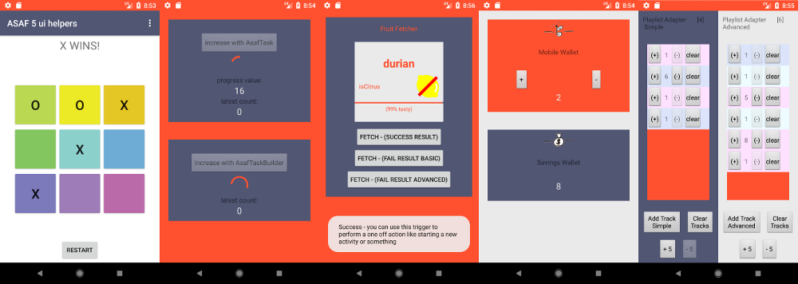
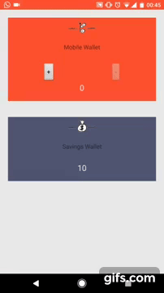
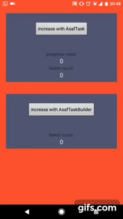
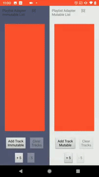
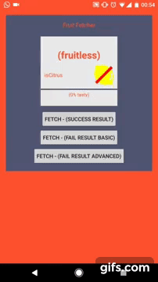

# android fore

[](https://github.com/erdo/android-fore/blob/master/LICENSE.txt){: .float-left}

{: .float-left}

{: .float-left}

[](https://circleci.com/gh/erdo/android-fore/tree/master){: .float-left}

<br/>
<br/>

[(click here if you're reading this on github)](https://erdo.github.io/android-fore/#shoom)

**fore** helps you move code out of the view layer, leaving your reactive view code to deal with the absolute fundamentals: *what things look like*

## Quick Start

the **kotlin** API, running coroutines under the hood:
```
implementation("co.early.fore:fore-kt:1.4.7")
```

the original **java** API:
```
implementation("co.early.fore:fore-jv:1.4.7")
```

*(and you now need mavenCentral() listed as a repository in your build files as jcenter is closing)*

**fore 1.4.7** is built with Kotlin 1.5.10, the last version to be built with Kotlin 1.4.30 was **fore 1.4.6** More detailed [version information here](https://erdo.github.io/android-fore/06-upgrading.html#shoom).


## New to fore

This repo includes the tiny fore-core library, the optional packages, and 10 mini example apps. Any updates to fore are immediately reflected in the example apps and all their tests need to pass before new versions of fore are released, so they tend to remain current and are a good place to start if you're trying to figure out how things fit together:

`git clone git@github.com:erdo/android-fore.git`

There are also a few tutorials on dev.to [like this one](https://dev.to/erdo/tutorial-spot-the-deliberate-bug-165k) which demonstrates how the syncView() convention helps you to write less code, while removing a whole class of UI consistency bugs from the UI layer. Or [this one](https://dev.to/erdo/tutorial-android-architecture-blueprints-full-todo-app-mvo-edition-259o) which details the whys and the hows of converting the Android Architecture Blueprint Todo sample app from MVP to [MVO](https://erdo.github.io/android-fore/00-architecture.html#shoom) using fore.

A few other sample apps are listed in the [github project summary](https://github.com/erdo?tab=projects) for android-fore. Like this sample app which uses fore to implement a [clean architecture module](https://github.com/erdo/clean-modules-sample) struture.


## Overview

Imagine your app existing entirely separately from its UI (its UI could be a command line interface, or a GUI - the app shouldn't care or even know what type of UI it has). Then imagine the UI layer as a thin window on to this app, free to deal exclusively with _what things look like_.

This is a goal of a lot of architectures and it's a great way to develop anything that has a UI. It's especially helpful for a platform like android with its ephemeral view layer that gets destroyed and recreated on rotation. It also lets you unit test almost everything, the UI layer becoming as close to trivial as possible.

## Observers and Observables

This is the kind of challenge that the [observer pattern](https://en.wikipedia.org/wiki/Observer_pattern) has been solving for decades. And the main innovation in **fore** is its radically simplified observer implementation. It lets you decouple architectural layers to a degree that would not normally be possible.

Fore's observable classes let you **make anything observable** (usually it's repositories or classes in the domain layer that are made **observable**, and things in the view layer like activities, fragments or custom views do the **observing**). Here's how you make an AccountRepository class observable for example (no need to use a Repository for this, it works with any class):


<!-- Tabbed code sample -->
 <div class="tab">
   <button class="tablinks java" onclick="openLanguage('java')">Java</button>
   <button class="tablinks kotlin" onclick="openLanguage('kotlin')">Kotlin</button>
 </div>

<pre class="tabcontent tabbed java"><code>
public class AccountRepository extends ObservableImp {

  public AccountRepository(WorkMode workMode) {
    super(workMode);
  }

  ...

}
 </code></pre>

<pre class="tabcontent tabbed kotlin"><code>
class AccountRepository
: Observable by ObservableImp() {

  ...

}
 </code></pre>


 Somewhere in the view layer (Activity/Fragment/View or ViewModel) there will be a piece of code like this:


 <!-- Tabbed code sample -->
  <div class="tab">
    <button class="tablinks java" onclick="openLanguage('java')">Java</button>
    <button class="tablinks kotlin" onclick="openLanguage('kotlin')">Kotlin</button>
  </div>

 <pre class="tabcontent tabbed java"><code>
 Observer observer = this::syncView;
  </code></pre>

 <pre class="tabcontent tabbed kotlin"><code>
 val observer = Observer { syncView() }
  </code></pre>


And that observer is typically added and removed from the observable in line with lifecycle methods so that we dont get any memory leaks. In the case below, a fragment is observing a Wallet [model](https://en.wikipedia.org/wiki/Domain_model) representing the details of a user's wallet.

<!-- Tabbed code sample -->
 <div class="tab">
   <button class="tablinks java" onclick="openLanguage('java')">Java</button>
   <button class="tablinks kotlin" onclick="openLanguage('kotlin')">Kotlin</button>
 </div>

<pre class="tabcontent tabbed java"><code>
@Override
protected void onStart() {
    super.onStart();
    wallet.addObserver(observer);
    syncView(); //  <- don't forget this
}

@Override
protected void onStop() {
    super.onStop();
    wallet.removeObserver(observer);
}
 </code></pre>

<pre class="tabcontent tabbed kotlin"><code>
override fun onStart() {
    super.onStart()
    wallet.addObserver(observer)
    syncView() //  <- don't forget this
}

override fun onStop() {
    super.onStop()
    wallet.removeObserver(observer)
}
 </code></pre>

(fore has a low boiler-plate overhead and it becomes even more apparent as screen complexity increases, see [here](https://erdo.github.io/android-fore/03-reactive-uis.html#removing-even-more-boiler-plate) for details)

All that's left to do now is to implement **syncView()** which will be called on the UI thread whenever the state of the observables change. You'll probably notice that syncView() shares some characteristics with MVI's render() or MvRx's invalidate(), though you might be surprised to learn that syncView() has been used in commercial android apps since at least 2013!

<!-- Tabbed code sample -->
 <div class="tab">
   <button class="tablinks java" onclick="openLanguage('java')">Java</button>
   <button class="tablinks kotlin" onclick="openLanguage('kotlin')">Kotlin</button>
 </div>

<pre class="tabcontent tabbed java"><code>
public void syncView(){
    increaseMobileWalletBtn.setEnabled(wallet.canIncrease());
    decreaseMobileWalletBtn.setEnabled(wallet.canDecrease());
    mobileWalletAmount.setText("" + wallet.getMobileWalletAmount());
    savingsWalletAmount.setText("" + wallet.getSavingsWalletAmount());
}
 </code></pre>

<pre class="tabcontent tabbed kotlin"><code>
override fun syncView() {
    wallet_increase_btn.isEnabled = wallet.canIncrease()
    wallet_decrease_btn.isEnabled = wallet.canDecrease()
    wallet_mobileamount_txt.text = wallet.mobileWalletAmount.toString()
    wallet_savingsamount_txt.text = wallet.savingsWalletAmount.toString()
    wallet_balancewarning_img.showOrGone(wallet.mobileWalletAmount<2)
}
 </code></pre>

Here's a very basic example from one of the example kotlin apps included in the fore repo: [View](https://github.com/erdo/android-fore/blob/master/example-kt-01reactiveui/src/main/java/foo/bar/example/forereactiveuikt/ui/wallet/WalletsActivity.kt) and [Model](https://github.com/erdo/android-fore/blob/master/example-kt-01reactiveui/src/main/java/foo/bar/example/forereactiveuikt/feature/wallet/Wallet.kt) code, and the tests: a [Unit Test](https://github.com/erdo/android-fore/blob/master/example-kt-01reactiveui/src/test/java/foo/bar/example/forereactiveuikt/feature/wallet/WalletTest.kt) for the Model, and an [Espresso Test](https://github.com/erdo/android-fore/blob/master/example-kt-01reactiveui/src/androidTest/java/foo/bar/example/forereactiveuikt/ui/wallet/WalletsActivityTest.kt) for the View

In that example the wallet state is being exposed via getters / properties, but the state could just as well be exposed via a single immutable state - it's entirely up to you how to write your code, it makes no difference to the syncView() technique.

**fore** enables you to write view layers that are particularly sparse, and the apps are highly scalable from a complexity standpoint. This makes **fore** suitable for both quick prototypes, and large complex commercial projects with 100K+ lines of code.

 Specifically _why_ it is that apps written this way are both sparse _and_ scalable is not always immediately obvious. This [discussion](https://erdo.github.io/android-fore/03-reactive-uis.html#somethingchanged-parameter) gets into the design of the **fore** api and why it drastically reduces boiler plate for a typical android app compared with alternatives. Some of the dev.to tutorials (see above) also touch on this. But these are subtle, advanced topics that are not really necessary to use **fore** at all - most of the actual code in the fore library is quite simple.

In fact fore itself is tiny: just over 500 lines of code for the core package The java version references **128 methods** in all, and adds just **12.5KB** to your apk _before_ obfuscation.

MVO implemented with fore addresses issues like **testability**; **lifecycle management**; **UI consistency**; **memory leaks**; and **development speed** - and if you're spending time dealing with any of those issues in your code base or team, it's well worth considering.


### Still reading?

In a nutshell, developing with **fore** means writing:

> "Observable **Models**; **Views** doing the observing; and some **Reactive UI** tricks to tie it all together"

In [**MVO**](https://erdo.github.io/android-fore/00-architecture.html#shoom) (like with most MV* architectures) the model knows nothing about the View. When the view is destroyed and recreated, the view re-attaches itself to the model in line with the android lifecyce. Any click listeners or method calls as a result of user interaction are sent directly to the relevant model (be that an application level scoped model, or a ViewModel). With this architecture you remove a lot of problems around lifecycle management and handling rotations on android, it also turns out that the code to implement this is a lot less verbose **(and it's also very testable and scalable)**.

**There are a few important things in MVO that allow you an architecture this simple:**

* The first is a very robust but simple [**Observer API**](https://erdo.github.io/android-fore/03-reactive-uis.html#somethingchanged-parameter) that lets views attach themselves to any model they are interested in
* The second is the [**syncView()**](https://erdo.github.io/android-fore/01-views.html#syncview) convention
* The third is writing [**models**](https://erdo.github.io/android-fore/02-models.html#shoom) at an appropriate level of abstraction, something which comes with a little practice
* The fourth is making appropriate use of [**DI**](https://erdo.github.io/android-fore/05-extras.html#dependency-injection-basics)

If you totally grok those 4 things, that's pretty much all you need to use **fore** successfully, the [**code review guide**](https://erdo.github.io/android-fore/05-extras.html#troubleshooting--how-to-smash-code-reviews) should also come in handy as you get up to speed, or you bring your team up to speed.

The **fore** library also includes a few fore [extension functions](https://github.com/erdo/android-fore/blob/master/fore-core-kt/src/main/java/co/early/fore/kt/core/coroutine/Ext.kt) that are all you need to use coroutines in a way that makes them completely testable (something that is [still](https://github.com/Kotlin/kotlinx.coroutines/pull/1206), [pending](https://github.com/Kotlin/kotlinx.coroutines/pull/1935) in the official release).

For Java development, there are some testable wrappers for AsyncTask (that Google should have provided, but didn't) [**Async**](https://erdo.github.io/android-fore/04-more-fore.html#asynctasks-with-lambdas) and [**AsyncBuilder**](https://erdo.github.io/android-fore/04-more-fore.html#asyncbuilder) - which support lambdas, making threads very easy to use.

There are also optional extras that simplify [**adapter animations**](https://erdo.github.io/android-fore/04-more-fore.html#adapter-animations) and abstract your networking layer when using [**Retrofit2**, **Ktor** or **Apollo**](https://erdo.github.io/android-fore/04-more-fore.html#fore-network). **fore** works really well with RoomDB too, checkout the sample app for details.

## Sample Apps



The mini example apps included with the repo are deliberately sparse and ugly so that you can see exactly what they are doing. These are not examples for how to nicely structure XML layouts and they are not written using jetpack compose yet - all that you can do later in the **View** layers and it should have no impact on the stability of the app.

These apps are however, totally robust and comprehensively tested (and properly support rotation). And that's really where you should try to get to as quickly as possible, so that you can **then** start doing the fun stuff like adding beautiful graphics and cute animations.

For these example apps, all the **View** components are located in the **ui/** package and the **Models** are in the **feature/** package. This package structure gives the app code good glanceability and should let you find what you want easily.

For the sample apps there is a one-to-one relationship between the sub-packages within **ui/**, and the sub-packages within **feature/** but it needn't be like that and for larger apps it often isn't. You might have one BasketModel but it will be serving both a main BasketView and a BasketIconView located in a toolbar for instance. A more complex view may use data from several different models at the same time eg a BasketModel and an AccountModel.

<div class="shoom" id="fore-1-reactive-ui-example"/>
### **fore 1** Reactive UI Example

[video](https://www.youtube.com/watch?v=wDu6iaSzKHI) \| [source code (java)](https://github.com/erdo/android-fore/tree/master/example-jv-01reactiveui) \| [source code (kotlin)](https://github.com/erdo/android-fore/tree/master/example-kt-01reactiveui)



This app is a bare bones implementation of **fore** reactive UIs. No threading, no networking, no database access - just the minimum required to demonstrate [Reactive UIs](https://erdo.github.io/android-fore/03-reactive-uis.html#shoom). It's still a full app though, supports rotation and has a full set of tests to go along with it.

In the app you move money from a "Savings" wallet to a "Mobile" wallet and then back again. It implements a tiny section of the diagram from the [architecture](https://erdo.github.io/android-fore/00-architecture.html#bad-diagram) section.


<div class="shoom" id="fore-2-async-example"/>
### **fore 2** Asynchronous Code Example

[video](https://www.youtube.com/watch?v=di_xvaYUTxo) \| [source code (java)](https://github.com/erdo/android-fore/tree/master/example-jv-02threading) \| [source code (kotlin)](https://github.com/erdo/android-fore/tree/master/example-kt-02coroutine)



This one demonstrates asynchronous programming, and importantly how to test it. The **java** version uses ([Async](https://erdo.github.io/android-fore/04-more-fore.html#async) and [AsyncBuilder](https://erdo.github.io/android-fore/04-more-fore.html#asyncbuilder)), the **kotlin** version uses coroutines (with some [fore extensions](https://github.com/erdo/android-fore/blob/master/fore-core-kt/src/main/java/co/early/fore/kt/core/coroutine/Ext.kt) that make the coroutines unit testable). Again, it's a bare bones (but complete and tested) app - just the minimum required to demonstrate asynchronous programming.

This app has a counter that you can increase by pressing a button (but it takes time to do the increasing - so you can rotate the device, background the app etc and see the effect).

<div class="shoom" id="fore-3-adapter-example"/>
### **fore 3** Adapter Example

[video](https://www.youtube.com/watch?v=eAbyhOyoMxU) \| [source code (java)](https://github.com/erdo/android-fore/tree/master/example-jv-03adapters) \| [source code (kotlin)](https://github.com/erdo/android-fore/tree/master/example-kt-03adapters)



This one demonstrates how to use [**adapters**](https://erdo.github.io/android-fore/04-more-fore.html#adapter-animations) with **fore**.

The **java** sample has two lists side by side so you can see the how the implementation differs depending on if you are backed by immutable list data (typical in architectures that use view states such as MVI) or mutable list data. As usual it's a complete and tested app but contains just the minimum required to demonstrate adapters.

The **kotlin** version has three lists, adding an implementation of google's **AsyncListDiffer**. All three implementations have slightly different characteristics, most notably the google version moves logic out of the model and into the adapter (that's why it doesn't automatically support rotation - but it could be added easiy enough by passing an external list copy to the adapter). Check the source code for further infomation.

The UI for each app is deliberately challenging to implement on android, and although it's ugly, the UI lets you smash buttons to not only add and remove multiple items, but also to change the state of each item in the list. All changes are animated, it supports rotation, it's totally robust and the UI layer is extremely thin for both apps.


<div class="shoom" id="fore-4-retrofit-example"/>
### **fore 4** Retrofit Example

[video](https://www.youtube.com/watch?v=zOIoK8Fj0Ug) \| [source code (java)](https://github.com/erdo/android-fore/tree/master/example-jv-04retrofit) \| [source code (kotlin)](https://github.com/erdo/android-fore/tree/master/example-kt-04retrofit)



Clicking the buttons in this app will perform network requests to some static files that are hosted on [Mocky](https://www.mocky.io/) (have you seen that thing? it's awesome). The buttons make various network connections, various successful and failed responses are handled in different ways. It's all managed by the [CallProcessor](https://erdo.github.io/android-fore/04-more-fore.html#fore-network) class which is the main innovation in the fore-network library, the kotlin implementation of CallProcessor is implemented with coroutines and has an API better suited to kotlin and functional programming.

As you're using the app, please notice:

- **how you can rotate the device with no loss of state or memory leaks**. I've used Mocky to add a delay to the network request so that you can rotate the app mid-request to clearly see how it behaves (because we have used **fore** to separate the view from everything else, rotating the app makes absolutely no difference to what the app is doing, and the network busy spinners remain totally consistent). Putting the device in airplane mode also gives you consistent behaviour when you attempt to make a network request.

As usual this is a complete and tested app. In reality the tests are probably more than I would do for a real app this simple, but they should give you an idea of how you can do **unit testing**, **integration testing** and **UI testing** whilst steering clear of accidentally testing implementation details.

<div class="shoom" id="fore-7-apollo-example"/>
### **fore 7** Apollo Example
[source code (kotlin)](https://github.com/erdo/android-fore/tree/master/example-kt-07apollo)
In a similar vein we have a networking sample that integrates with a GraphQL API using Apollo. Includes the ability to chain network calls together, support rotation, handle all error conditions gracefully, and is competely testable / tested (Unit tests and UI tests) and of course has a wafer thin UI layer.

<div class="shoom" id="fore-8-ktor-example"/>
### **fore 8** Ktor Example
[source code (kotlin)](https://github.com/erdo/android-fore/tree/master/example-kt-08ktor)
Ditto but using Ktor (and OkHttp). And as usual includes the ability to chain network calls together, support rotation, handle all error conditions gracefully, and is competely testable / tested (Unit tests and UI tests)

<div class="shoom" id="fore-6-db-example-room"/>
### **fore 6** DB Example (Room db driven to-do list)

[video](https://www.youtube.com/watch?v=a1ehGU5O8i8) \| [source code (java)](https://github.com/erdo/android-fore/tree/master/example-jv-06db)


A To-do list on steroids that lets you:

- manually add 50 random todos at a time
- turn on a "boss mode" which randomly fills your list with even more todos over the following 10 seconds
- "work from home" which connects to the network and downloads 25 extra todos (up to 9 simultaneous network connections)
- randomly delete about 10% of your todos
- randomly change 10% of your outstanding todos to done

It's obviously ridiculously contrived, but the idea is to implement something that would be quite challenging and to see how little code you need in the view layer to do it.

It is driven by a Room db, and there are a few distinct architectural layers: as always there is a view layer and a model layer (in packages: ui and feature). There is also a networking and a persistence layer. The UI layer is driven by the model which in turn is driven by the db.

All the database changes are done away from the UI thread, RecyclerView animations using DiffUtil are supported (for lists below 1000 rows), the app is totally robust and supports rotation out of the box.

There is only one test class included with this app which demonstrates how to test Models which are driven by a Room DB (using CountdownLatches etc). For other test examples, please see sample apps 1-4


### Other Full App Examples

 All the known sample apps are listed in the [github project summary](https://github.com/erdo?tab=projects) for android-fore.

- Many of the **[dev.to](https://dev.to/erdo/tutorial-spot-the-deliberate-bug-165k)** tutorials have full sample apps associated with them, mostly kotlin
- This sample app uses fore to implement a [clean architecture module](https://github.com/erdo/clean-modules-sample) struture.
- Slightly larger app also written in Kotlin **[here](https://github.com/erdo/fore-full-example-02-kotlin)**


## Contributing
Please read the [Code of Conduct](https://erdo.github.io/android-fore/CODE-OF-CONDUCT.html#shoom), and check out the [issues](https://github.com/erdo/android-fore/issues) :)


## License


    Copyright 2015-2021 early.co

    Licensed under the Apache License, Version 2.0 (the "License");
    you may not use this file except in compliance with the License.
    You may obtain a copy of the License at

       http://www.apache.org/licenses/LICENSE-2.0

    Unless required by applicable law or agreed to in writing, software
    distributed under the License is distributed on an "AS IS" BASIS,
    WITHOUT WARRANTIES OR CONDITIONS OF ANY KIND, either express or implied.
    See the License for the specific language governing permissions and
    limitations under the License.
