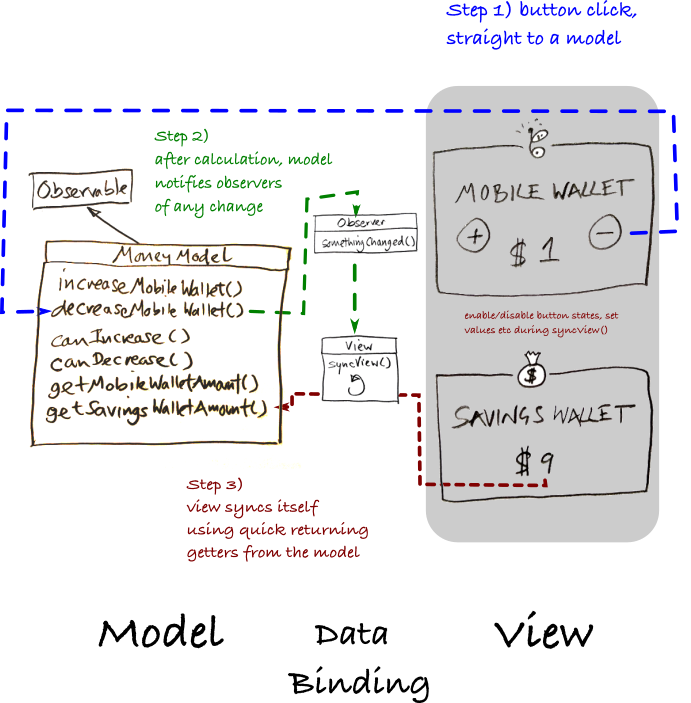

# ASAF
Alarmingly Simple Android Framework

A few tiny framework classes that help you write android code that is **simple**, **robust** and **performant** for even the most complex commercial grade android application.

The library is the result of over half a decade of app development in teams comprising developers with various backgrounds and abilities. It focuses relentlessly on being **clear** and **easy to understand**. Addressing areas such as **testability**; **lifecycle management**; **UI consistency**; and **memory leaks** it lets the developer focus on the cool stuff and not have to worry about the usual android problems.

Check out the [sample apps](#sample-apps) to see how it's done.


## Quick Start


```
compile (group: 'co.early.asaf', name: 'asaf-core', version: '0.9.21', ext: 'aar')
```
optional:

```
compile (group: 'co.early.asaf', name: 'asaf-adapters', version: '0.9.21', ext: 'aar')
compile (group: 'co.early.asaf', name: 'asaf-retrofit', version: '0.9.21', ext: 'aar')
```


## Overview

ASAF starts with the assumption that the clearer and more obvious code is, the easier it is to maintain, and the less likely it is that bugs will creep in when you're not looking.

Writing simple code is of course a lot harder than writing complicated code. And all code can get complicated - because often, once you get into it, requirements are complicated.

But that's not the whole story. There is also code which has nothing to do with features or business requirements, it's just there to handle the platform and tie things together. Sometimes this code is sprinkled throughout an app, mixed in with the busines logic, hiding in plain sight. This code is also where a lot of the bugs are found. Developing with ASAF isolates this code, drastically simplifies it and leaves your business logic testable and out in the clear.

The framework is basically a light touch implementation of **MVVM** written for Android using the observer pattern. Perhaps more appropriately it could be considered **MV** as we don't need to make a distinction between Models and ViewModels. It's flexible enough that you can use it to implement **MVP** if you wish.

In any case, all the sample apps included here are written in the same way, this technique results in an extremely concise code base, which of course is robust enough to support rotation and other context switches by default.

This diagram manges to make things look more complicated than they are, don't worry, the actual code is a lot cleaner!





At a very high level you will be writing observable and testable **Model** classes for all your logic, with **View** layer classes observing these models for any changes so that they can update their views immediately.

> "Observable **Models**; **Views** doing the observing; and some **Data Binding** tricks to tie it all together"

ASAF also includes a testable alternative for AsyncTask ([**AsafTask**](/asaf-project/04-more.html#asaftask) and [**AsafTaskBuilder**](/asaf-project/04-more.html#asaftaskbuilder)), and formalises an approach to **simple one way data binding** using a [**syncView()**](/asaf-project/03-databinding.html#syncview) method that never leaves your view out of sync with your model.

There are also optional extras that help with using ([**adapters**](/asaf-project/04-more.html#adapters) and working with [**Retrofit2**](/asaf-project/04-more.html#retrofit2)).

You might be surprised how much android code becomes unnecessary when you take this approach to development.

## Sample Apps

If you haven't coded with ASAF before, it's probably best to take a look at some of the  sample apps and literally copy and paste a feature and it's associated UI components (see the **feature/** and **ui/** packages) then change them from there.

As for the apps, they are deliberately sparse and ugly so that you can see exactly what they are doing. These are not examples for how to nicely structure XML layouts or implement ripple effects - all that you can do later in the **View** layers and it should have no impact on the stability of the app.

ASAF has been designed to make the most of lambda expressions by the way however most of the sample apps don't use lambdas - purely to make the code more accessible to people who aren't comfortable with them yet. Obviously replacing the anonymous inner classes with lambdas will make the code even tighter.

These apps are however, totally robust and comprehensively tested. And that's really where you should try to get to as quickly as possible, so that you can **then** start doing the fun stuff like adding beautiful graphics and cute animations.

Asside from the apps, there is also a lot of information (and more crap diagrams) in this guide that will take you through the detail of how and why ASAF works.


### ASAF 1 Data Binding Example

[screen shot](https://raw.githubusercontent.com/erdo/asaf-project/master/exampledatabinding/screenshot.png)

This app is a bare bones implementation ASAF databinding. No threading, no networking, no database access - just the minimum required to demostrate [**Data Binding**](/asaf-project/03-databinding.html#shoom). It's still a full app though, supports rotation and has a full set of tests to go along with it.

In the app you move money from a "Savings" wallet to a "Mobile" wallet and then back again. It's inspiration is the diagram above, although it sadly doesn't look quite as awesome as that diagram does.

[Data Binding Example App Source Code](https://github.com/erdo/asaf-project/tree/master/exampledatabinding)


### ASAF 2 Asynchronous Code Example

[screen shot](https://raw.githubusercontent.com/erdo/asaf-project/master/examplethreading/screenshot.png)

This one demostrates asynchronous programing, and importantly how to test it. It uses ([**AsafTask**](/asaf-project/04-more.html#asaftask) and [**AsafTaskBuilder**](/asaf-project/04-more.html#asaftaskbuilder)). Again, it's a bare bones (but complete and tested) app - just the minimum required to demostrate asynchronous programing.

This app has a counter that you can increase by pressing a button (but it takes 20 seconds to do the increasing - during which time you can rotate the device, background the app etc). There are two methods demonstrated, one which allows you to publish progress, one which lets you take advantage of lambda expressions.

It's really a very exciting app, I should probably put it on the play store before someone steals the idea.

[Asynchronous Example App Source Code](https://github.com/erdo/asaf-project/tree/master/examplethreading)


### ASAF 3 Adapter Code Example

[screen shot](https://raw.githubusercontent.com/erdo/asaf-project/master/exampleadapters/screenshot.png)

This one demostrates how to use [**adapters**](/asaf-project/04-more.html#adapters) with ASAF (essentially call notifyDataSetChanged() inside the syncView() method).

It also demonstrates how to take advantage of the built in list animations that Android provides. Once you have set your adapter up correctly, you just call notifyDataSetChangedAuto() inside the syncView() method and ASAF will take care of all the notify changes work.

Two lists are displayed side to side so you can see the effect this has when adding or removing items.

As usual it's a complete and (~~and tested app~~ watch this space, I've been busy :/ ) but contains just the minimum required to demostrate adapters. It's not been nominated for any design awards, as yet.

[Adapter Example App Source Code](https://github.com/erdo/asaf-project/tree/master/exampleadapters)


### ASAF 4 Retrofit Code Example

[screen shot](https://raw.githubusercontent.com/erdo/asaf-project/master/exampleretrofit/screenshot.png)

If you're using Retrofit (and I'm guessing you probably are), there are some nice ASAF classes that help you use [Retrofit2](/asaf-project/04-more.html#retrofit2) in a particularly clean and testable way. This is example app for that.

Clicking the buttons will perform a network request to some static files that are hosted on [Mocky](https://www.mocky.io/) (have you seen that thing? it's awesome!).

The first button gets a successful response, the last two get failed responses. The failed responses are handled in two different ways. The first is a simple error, based on the HTTP code the app receives back from the server. The other is a more specific error based on parsing the body of the error response for an error object.

As you're using the app, notice:

- **how you can rotate the device with no loss of state or memory leaks**. I've used Mocky to add a 3 second delay to the network request so that you can rotate the app mid-request to clearly see how it behaves (because we have used ASAF to seperate the view from everything else, rotating the app makes absolutely no difference to what the app is doing).
- **how it is not possible to mess things up by speed tapping the buttons**. No matter how rapidly the testers can click multiple buttons, the app is totally robust. It is robust for two reasons: One is that the model checks to see if it's busy before starting anything anyway. The other is that all the button clicks come through on the UI thread, so it's impossible for two threads to access the model methods simultaneously, see more on that in [model](/asaf-project/02-models.html#shoom) section.

The app contains just the minimum code required to demonstrate networking (ok apart from an unecessary animated-tasty-rating-bar, but whatever, it's just one class ;p ).

But as usual it's a complete and tested app. In reality the tests are probably more than I would do for a real app, but they should give you an idea of how you can do **unit testing**, **integration testing** and **UI testing** whilst steering clear of accidentally testing implementation details when using ASAF.

I also hope you appreciate the lemon icons, I made them in Inkscape.

[Networking Example App Source Code](https://github.com/erdo/asaf-project/tree/master/exampleretrofit)


### Basic Twitter Client Example

//TODO


### Tic Tac Toe Example

//TODO


License
-------

    Copyright 2017 early.co

    Licensed under the Apache License, Version 2.0 (the "License");
    you may not use this file except in compliance with the License.
    You may obtain a copy of the License at

       http://www.apache.org/licenses/LICENSE-2.0

    Unless required by applicable law or agreed to in writing, software
    distributed under the License is distributed on an "AS IS" BASIS,
    WITHOUT WARRANTIES OR CONDITIONS OF ANY KIND, either express or implied.
    See the License for the specific language governing permissions and
    limitations under the License.

